# Job Aggregation Platform — Analytics Summary

**Prepared for:** Engineering & Product Management
**Data source:** `jobs.json` (155,794 unique job records, latest pipeline run)
**Reference document:** `research/api_analysis.md` (regional, freshness, duplicate, and API
research — this report computes and presents the management-facing numbers; see that document
for full methodology, provider-by-provider detail, and expansion recommendations)
**Snapshot date:** newest `posted` value in the data is 2026-07-03; "today" for age calculations
is 2026-07-06.

---

## Executive Summary

The platform aggregates **155,794 unique jobs** from **20 registered providers** (19 currently
contributing) into a single normalized schema. Coverage is broad but **heavily concentrated**:
one region (United States, 51%) and one provider (SmartRecruiters, 41.8%) dominate the dataset,
and a single employer (Domino's) alone accounts for **15.7% of all jobs**. Deduplication is
working correctly — **zero duplicate URLs remain** — though a large volume of same-title,
same-company postings reflects genuine multi-location retail/logistics roles rather than
aggregation errors. Freshness is moderate: **54% of jobs were within 30 days old at collection
time**, but **46% are stale**, with no scheduled refresh or expiry in place to keep that ratio
from worsening. Remote roles are a small minority (10.9%). The dataset is production-ready as a
periodic bulk job board; the highest-value next steps are broadening regional/provider balance
and introducing a refresh-and-expiry cycle (see `research/api_analysis.md` §§14, 19 for the
detailed roadmap).

---

## Dataset Overview

| Metric | Value |
|---|---:|
| Total unique jobs | **155,794** |
| Registered providers | 20 |
| Providers contributing in latest run | 19 (TheirStack blocked — HTTP 402 plan restriction) |
| Distinct companies represented | **9,497** |
| Jobs with empty/missing company name | 45 (0.03%) |
| Jobs with empty/missing location | 72 (0.05%) |
| Jobs with empty `tags` | 11,762 (7.5%) |
| Jobs with a parseable `posted` date | 155,779 (99.99%) |
| Duplicate URLs remaining in dataset | **0** |
| Schema fields | `title`, `company`, `location`, `url`, `tags`, `remote`, `posted` (7 fields, fully normalized) |

The dataset is a **static snapshot** — a single JSON file rewritten on each full pipeline run,
with no incremental sync, no per-job history, and no expiry mechanism.

---

## Regional Coverage

| Region | Jobs | % of dataset |
|---|---:|---:|
| United States | 79,427 | 51.0% |
| Europe (continental, non-UK) | 21,886 | 14.0% |
| United Kingdom | 10,305 | 6.6% |
| LATAM | 6,955 | 4.5% |
| Singapore / Southeast Asia | 4,629 | 3.0% |
| Canada | 3,436 | 2.2% |
| Remote / Worldwide (no fixed region) | 822 | 0.5% |
| Other / Unclassified location text | 28,334 | 18.2% |

**Sum of the six primary target regions: 126,638 jobs (81.3%)** of the dataset.

**Top countries by job count:**

| Rank | Country | Jobs | % |
|---:|---|---:|---:|
| 1 | United States | 79,427 | 51.0% |
| 2 | Germany | 12,167 | 7.8% |
| 3 | United Kingdom | 10,305 | 6.6% |
| 4 | India | 3,471 | 2.2% |
| 5 | Canada | 3,436 | 2.2% |
| 6 | France | 2,218 | 1.4% |
| 7 | China | 1,435 | 0.9% |
| 8 | Australia | 1,225 | 0.8% |

**Observation:** the United States alone exceeds the combined total of every other region.
Canada is the weakest of the six primary target regions at 2.2% — under half the size of the
UK's dedicated coverage despite both being first-class targets. 18.2% of jobs carry location
text too ambiguous to classify into a region, which caps the reliability of any location-based
filter or map feature at its current form.

---

## Provider Coverage

Provider attribution reconstructed from each job's URL host (the schema does not carry an
explicit `source` field):

| Provider | Jobs | % of dataset |
|---|---:|---:|
| SmartRecruiters | 65,193 | 41.8% |
| Lever | 17,755 | 11.4% |
| Greenhouse (both hosts) | 14,930 | 9.6% |
| USAJOBS | 10,000 | 6.4% |
| Reed | 9,000 | 5.8% |
| Bundesagentur (+ AMS) | ~7,800 | ~5.0% |
| Ashby | 5,171 | 3.3% |
| Workable | 4,159 | 2.7% |
| Jooble | ~3,100 | ~2.0% |
| Himalayas | 2,964 | 1.9% |
| Adzuna | 2,001 | 1.3% |
| The Muse | 2,000 | 1.3% |
| Arbeitnow | 930 | 0.6% |
| Teamtailor | 474 | 0.3% |
| SerpApi, OpenWeb Ninja, Careerjet, RemoteOK, Jobicy (combined) | ~350 | ~0.2% |
| TheirStack | 0 | 0.0% (plan-gated, HTTP 402) |

**Observation:** a single provider, SmartRecruiters, supplies **more than 4 in 10 jobs** in the
entire dataset. The top three providers (SmartRecruiters, Lever, Greenhouse) together account
for **62.8%** of all jobs. Regional and company composition is therefore driven largely by
*which companies were curated into these ATS provider lists*, not by a balanced global crawl.
Six metered/low-yield sources (SerpApi, OpenWeb Ninja, Careerjet, RemoteOK, Jobicy, Arbeitnow)
combined contribute under 1% of total volume.

---

## Job Freshness

Age measured against the dataset's collection date (2026-07-03):

| Age at collection | Jobs | Cumulative "within" | Cumulative % |
|---|---:|---:|---:|
| Within 24 hours | 24,052 | 24,052 | 15.4% |
| Within 3 days | +6,582 | 30,634 | 19.7% |
| Within 7 days | +11,884 | 42,518 | 27.3% |
| Within 14 days | +24,610 | 67,128 | 43.1% |
| Within 30 days | +16,949 | 84,077 | **54.0%** |
| Older than 30 days | 71,702 | — | **46.0%** |
| Unknown / unparseable | 15 | — | 0.0% |

**Total current jobs (≤ 30 days): 84,077 → 54.0% of the dataset.**
**Total stale jobs (> 30 days, incl. unknown): 71,717 → 46.0% of the dataset.**

**Deep-stale tail:**

| Age | Jobs | % |
|---|---:|---:|
| Older than 90 days | 45,075 | 28.9% |
| Older than 180 days | 29,640 | 19.0% |
| Older than 365 days | 21,768 | 14.0% |

Oldest posting on record: **2009-12-05**. Median posting date: **2026-06-09**.

**Observation:** at collection time, a slim majority of the dataset was fresh, but nearly half
is already stale, and 14% is over a year old. The dataset has **no scheduled refresh and no
expiry logic**, so this ratio only worsens with time — every day since collection, the "current"
fraction shrinks with no offsetting mechanism. This is a structural/architectural issue rather
than a sourcing issue: it is concentrated in large enterprise ATS boards that return every
currently-open requisition, including long-standing evergreen roles.

### 1. Current Active Jobs

| Bucket | Jobs | % of dataset |
|---|---:|---:|
| Within 24 hours | 24,052 | 15.4% |
| Within 3 days (cumulative) | 30,634 | 19.7% |
| Within 7 days (cumulative) | 42,518 | 27.3% |
| Within 14 days (cumulative) | 67,128 | 43.1% |
| Within 30 days (cumulative) | **84,077** | **54.0%** |
| **Active jobs (≤ 30 days)** | **84,077** | **54.0%** |
| **Potentially stale jobs (> 30 days, incl. unknown)** | **71,717** | **46.0%** |

**What this means for users:** just over half of the platform (54.0%) contains jobs a typical
user would reasonably consider "active" — posted within the last month. The remaining 46.0%
(71,717 jobs) is old enough that a user encountering one of these listings might reasonably
question whether it is still open. This is not evenly distributed within that 46%: 28.9% of the
*entire dataset* is older than 90 days, and 14.0% is older than a full year — these deeper tiers
are where the risk of showing a genuinely closed position to a user is highest, and are the
most urgent candidates for revalidation (see Management Summary, below).

### 2. Provider Freshness Ranking

Every implemented provider, ranked by freshness rate (jobs ≤30 days ÷ that provider's own total).
Sixteen providers are individually attributable by URL host; the four lowest-volume/metered
sources (SerpApi, OpenWeb Ninja, CareerJet, TheirStack) route through third-party or company
domains that cannot be cleanly separated from other "Other"-bucket URLs, so they are shown
combined, consistent with the provider breakdown used elsewhere in this report.

| Provider | Total Jobs | Jobs ≤ 30 Days | Freshness % | Notes |
|---|---:|---:|---:|---|
| Bundesagentur | 7,800 | 7,800 | 100.0% | Public agency feed; project pulls the newest slice each run |
| Himalayas | 2,964 | 2,964 | 100.0% | Newest-first pull of a 90,000+ job archive; only the recent slice is fetched |
| Arbeitnow | 930 | 930 | 100.0% | Small board fetched to full exhaustion every run |
| RemoteOK | 100 | 100 | 100.0% | Fixed ~100-job newest-only snapshot; no pagination exists |
| Jobicy | 100 | 100 | 100.0% | Fixed ~100-job snapshot; no pagination exists |
| Reed | 9,000 | 8,658 | 96.2% | UK board with genuinely high listing turnover |
| Jooble | 3,127 | 2,973 | 95.1% | Aggregator; underlying listings it surfaces turn over quickly |
| Adzuna | 2,001 | 1,467 | 73.3% | Single-country (US) browse; moderate turnover |
| USAJOBS | 10,000 | 6,138 | 61.4% | Federal postings often have long, policy-driven application windows |
| SmartRecruiters | 65,193 | 36,479 | 56.0% | Mix of very-high-turnover boards (e.g., Domino's) and slower corporate boards |
| Other (SerpApi, OpenWeb Ninja, CareerJet, TheirStack, misc.) | 10,108 | 5,091 | 50.4% | Mixed metered/aggregator sources; not separable by URL alone |
| Teamtailor | 456 | 176 | 38.6% | Small company career-site RSS feeds; moderate turnover |
| Greenhouse | 14,930 | 5,013 | 33.6% | Full-board ATS fetch; many long-open corporate requisitions |
| Ashby | 5,171 | 1,688 | 32.6% | Full-board ATS fetch; growth-stage company boards, slower-cycling roles |
| The Muse | 2,000 | 615 | 30.8% | Curated aggregator; unauthenticated browse skews toward older listings |
| Workable | 4,159 | 1,232 | 29.6% | Full-board ATS fetch; SMB/staffing boards with longer time-to-fill |
| Lever | 17,755 | 2,653 | 14.9% | Full-board ATS fetch; largest share of long-open, evergreen-style postings |
| TheirStack | 0 | 0 | n/a | Plan-gated (HTTP 402); contributes no jobs currently |

**Why some providers are fresher than others:** the five 100%-fresh providers fall into two
patterns — either a genuinely bounded, newest-first pull (Himalayas, Bundesagentur), or a
fixed-size snapshot API that only ever returns its ~100 newest postings with no way to reach
further back (RemoteOK, Jobicy), or a small board that is fetched to full exhaustion each run
(Arbeitnow) so nothing old is ever "left behind." At the other end, Lever, Workable, The Muse,
Ashby, and Greenhouse are all **full-board ATS fetches**: every run returns *every* currently
open requisition regardless of age, and none of these five APIs expose a request-side date
filter to exclude old ones. Their freshness is therefore entirely a function of how long the
underlying employer leaves a role open — not of anything this pipeline currently controls.

### 3. Stale Job Analysis

Providers ranked by **absolute number** of stale (>30-day) jobs contributed:

| Rank | Provider | Stale Jobs | Likely cause |
|---:|---|---:|---|
| 1 | SmartRecruiters | 28,714 | Evergreen ATS jobs — Domino's alone contributes tens of thousands of standing, store-level requisitions that stay open indefinitely |
| 2 | Lever | 15,102 | Evergreen ATS jobs — full-board fetch returns every open corporate requisition regardless of age |
| 3 | Greenhouse | 9,917 | Evergreen ATS jobs — same full-board dynamic; many roles stay open for months |
| 4 | Other (SerpApi, OpenWeb Ninja, CareerJet, TheirStack, misc.) | 5,017 | Aggregated listings — these sources re-surface third-party postings whose original posting date may predate when this pipeline captured them |
| 5 | USAJOBS | 3,862 | Government jobs — federal postings often carry long, policy-mandated application windows well past 30 days |
| 6 | Ashby | 3,483 | Evergreen ATS jobs — growth-stage company boards, slower-cycling roles |
| 7 | Workable | 2,927 | Evergreen ATS jobs — SMB/staffing boards with longer average time-to-fill |
| 8 | The Muse | 1,385 | Slow provider updates — curated aggregator skewing toward already-listed jobs |
| 9 | Adzuna | 534 | Moderate — single-country browse, some longer-lived listings |
| 10 | Reed | 342 | Minimal — high-turnover UK board |
| 11 | Teamtailor | 280 | Minimal — small boards, moderate turnover |
| 12 | Jooble | 154 | Minimal — aggregator with fast-turning listings |
| — | Bundesagentur, Himalayas, Arbeitnow, RemoteOK, Jobicy | 0 each | 100% fresh (see ranking above) |

**Pattern:** the three largest ATS providers (SmartRecruiters, Lever, Greenhouse) together
contribute **53,733 stale jobs — 74.9% of all stale jobs in the dataset** — entirely because
each is a full-board fetch with no date filter, not because of any pipeline defect. Government
postings (USAJOBS) are stale for a structurally different, legitimate reason (long official
application windows), and aggregated listings (the "Other" bucket) are stale because they
re-surface postings whose true origin date this pipeline doesn't control.

### 4. Expired Job Detection

For every implemented provider: does the raw API expose an expiry/closing date, a genuine
last-updated timestamp (distinct from the original posting date), and can inactive or deleted
postings be detected today?

| Provider | Expiry date available? | Closing date available? | Last updated available? | Inactive jobs detectable? | Deleted jobs identifiable? |
|---|---|---|---|---|---|
| Arbeitnow | No | No | No (`created_at` only) | No | No — would require run-to-run diffing |
| Himalayas | No | No | No (`pubDate` only) | No | No — would require run-to-run diffing |
| RemoteOK | No | No | No (`epoch` only) | No | No — snapshot-only API |
| Jobicy | No | No | No (`pubDate` only) | No | No — would require run-to-run diffing |
| The Muse | No | No | No (`publication_date` only) | No | No — would require run-to-run diffing |
| Bundesagentur | No | No | Partial (`aktuelleVeroeffentlichungsdatum` updates on republish) | Partial (age filter as a proxy) | No — would require run-to-run diffing |
| Jooble | No | No | **Yes** (`updated` field, genuine) | Partial (`datecreatedfrom` filter as a proxy) | No — would require run-to-run diffing |
| USAJOBS | **Yes** (`ApplicationCloseDate`, in API but not yet extracted) | **Yes** (same field) | No (posting date only) | **Yes, if extracted** | Partial — closed jobs drop from fresh searches once past close date |
| Adzuna | No | No | No (`created` only) | Partial (`max_days_old` filter as a proxy) | No — would require run-to-run diffing |
| Reed | No | No | No (`date` only) | No | No — also hits an error boundary near the pagination tail |
| SerpApi | No | No | No (relative text only, e.g. "3 days ago") | No | No — Google Jobs exposes no closure signal |
| OpenWeb Ninja | No | No | No (posted timestamp only) | Partial (`date_posted` filter as a proxy) | No — would require run-to-run diffing |
| CareerJet | No | No | No (`date` only) | No | No — would require run-to-run diffing |
| TheirStack | No | No | No (`date_posted` only) | Partial (age-filter proxy) | No — also currently plan-gated (0 jobs) |
| Greenhouse | No | No | **Yes** (`updated_at`, genuine, already used as a fallback) | No native field | **Yes** — full board returned each run, so absence-based diffing is reliable |
| Lever | No | No | No (`createdAt` only) | No native field | **Yes** — full board returned each run, absence-based diffing reliable |
| Ashby | No | No | No (`publishedAt` only) | No native field | **Yes** — full board returned each run, absence-based diffing reliable |
| SmartRecruiters | No | No | No (`releasedDate` only) | No native field | **Yes** — full board returned each run (care needed at Domino's-scale volume) |
| Workable | No | No | No (`published_on`/`created_at` only) | No native field | **Yes** — full board returned each run, absence-based diffing reliable |
| Teamtailor | No | No | No (`pubDate` only) | No native field | **Yes** — RSS feed returns the full current list each run, absence-based diffing reliable |

**Summary:** almost no provider exposes a native expiry/closing date — **USAJOBS is the sole
exception**, and even there, the field (`ApplicationCloseDate`) exists in the raw API response
but is not currently extracted by this pipeline. Genuine "last updated" signals exist for only
two providers (Jooble's `updated`, Greenhouse's `updated_at`). The six full-board ATS providers
(Greenhouse, Lever, Ashby, SmartRecruiters, Workable, Teamtailor) cannot detect inactivity via
any field, but **can** reliably detect deletions via simple run-to-run absence diffing, since
each already returns its entire current board on every run — the missing piece is persisting
what was seen last time, not a richer API capability.

### 5. Freshness Improvement Strategy

- **Incremental synchronization:** persist a per-job `first_seen`/`last_seen` watermark (using
  `createdAt`/`publishedAt`/`releasedDate`/`updated_at`, already returned by every provider) so
  each run can tell new postings from ones already known, rather than treating every run as a
  full replace.
- **Provider-specific refresh schedules:** match cadence to each provider's own turnover rate
  rather than using one schedule for all 20 — see daily vs. weekly split below.
- **Missing-job detection:** for the six full-board ATS providers, compare each run's set of
  job URLs/IDs against the previous run's; anything present last time but absent now has closed
  and should be flagged or removed.
- **Automatic expiration:** for providers with **no** closure signal at all (16 of 20), apply an
  age-based soft-expiry policy — e.g., flag or hide listings past a configurable threshold (60–90
  days) as "likely inactive" even without a hard signal from the source.
- **Run-to-run comparison:** the mechanism underlying both missing-job detection and automatic
  expiration — requires moving from the current single-file overwrite model to a persisted,
  keyed history of what was seen on each run.
- **Automatic stale-job removal:** once run-to-run comparison exists, jobs absent for N
  consecutive runs (for full-board ATS providers) or past a soft-expiry threshold (for
  no-signal providers) can be automatically retired from the active dataset rather than
  accumulating indefinitely.
- **Daily vs. weekly synchronization:**
  - **Daily:** SmartRecruiters, Reed, Bundesagentur, USAJOBS, Jooble — high-freshness-rate,
    high-volume providers whose own inventories already turn over fast enough to justify it.
  - **Weekly (or less):** Lever, Workable, The Muse, Ashby, Greenhouse, Teamtailor — low
    freshness-rate ATS providers where daily re-fetching mostly re-downloads the same long-open
    postings; engineering effort is better spent on incremental diffing for these than on
    increasing fetch frequency alone.

### 6. Management Summary

- **What percentage of jobs are likely active today?** 54.0% (84,077 of 155,794) were posted
  within the last 30 days and would read as current to a typical user.
- **What percentage should be revalidated?** 46.0% (71,717 jobs) are over 30 days old; within
  that, the highest-priority subset is the 28.9% of the *entire dataset* older than 90 days, and
  especially the 14.0% older than a full year, where the risk of showing an already-closed
  position is greatest.
- **Which providers need the most improvement?** Lever (14.9% fresh), Workable (29.6%), The Muse
  (30.8%), Ashby (32.6%), and Greenhouse (33.6%) have the lowest freshness rates; SmartRecruiters,
  despite a middling 56.0% rate, contributes the single largest *absolute* number of stale jobs
  (28,714) and should be prioritized for that reason even though its percentage looks less
  alarming than the five providers above.
- **What engineering work will improve freshness the most?** Incremental synchronization with
  run-to-run comparison, applied first to the three highest-absolute-stale-volume providers
  (SmartRecruiters, Lever, Greenhouse — together 74.9% of all stale jobs), combined with turning
  on the date filters already available but unused on Adzuna, USAJOBS, Bundesagentur, Jooble, and
  TheirStack. This is the same conclusion reached independently in `research/api_analysis.md`
  (Sections 17 and 20) and requires no new provider integration.

---

## Duplicate Analysis

| Check | Result |
|---|---:|
| Exact-URL duplicates remaining | **0** |
| Jobs with empty URL | **0** |
| Title + company collisions ("apparent duplicates") | 35,300 extra rows across 11,340 groups |
| Title + company + location collisions | 8,290 extra rows across 4,963 groups |
| Title+company groups spanning more than one distinct URL | 11,340 (100% of those groups) |

**Observation:** the pipeline's URL-based deduplication is working exactly as intended — zero
duplicate URLs and zero empty URLs remain. The 35,300 title+company "collisions" are **not**
missed duplicates: every one of those 11,340 groups spans multiple distinct URLs, and inspection
shows they are overwhelmingly **the same role posted at hundreds of separate physical
locations** (see Company Distribution below — Domino's "Delivery Driver," BoxLunch "Sales
Associate," etc.). Applying a naive title+company dedup rule would have erased tens of thousands
of legitimate, distinct job openings. The real (and much smaller) duplicate risk is
cross-provider overlap between aggregator-style sources, which current URL-keyed dedup does not
directly measure.

---

## Remote Jobs

| Metric | Value |
|---|---:|
| Jobs marked `remote: true` | 16,992 |
| Share of dataset | **10.9%** |
| Jobs marked `remote: false` | 138,802 (89.1%) |

**Observation:** roughly 1 in 9 jobs in the dataset is remote. Several sources are remote-only
by construction (Himalayas, RemoteOK, Jobicy), while most others derive `remote` either from a
genuine API field (Ashby, Lever, Workable, SmartRecruiters, Teamtailor, USAJOBS, SerpApi,
OpenWeb Ninja, TheirStack, Himalayas, RemoteOK, Jobicy) or a keyword heuristic on
title/location (Adzuna, Bundesagentur, Jooble, Reed, Greenhouse, Careerjet). Given only ~11% of
the dataset is remote, location quality (see Regional Coverage) is materially important for the
vast majority of listings.

---

## Company Distribution

| Metric | Value |
|---|---:|
| Distinct companies in dataset | **9,497** |
| Companies with exactly 1 job (long tail) | 5,505 (58.0% of distinct companies) |
| Share of dataset held by top 10 companies | 58,922 jobs — **37.8%** |
| Share of dataset held by top 25 companies | 74,061 jobs — **47.5%** |
| Share of dataset held by top 100 companies | 99,334 jobs — **63.8%** |

**Top companies by job count:**

| Rank | Company | Jobs | % of dataset |
|---:|---|---:|---:|
| 1 | Domino's | 24,448 | 15.69% |
| 2 | AccorHotel | 5,695 | 3.66% |
| 3 | AECOM | 4,802 | 3.08% |
| 4 | Bosch Group | 4,655 | 2.99% |
| 5 | ProSidian Consulting, LLC | 4,003 | 2.57% |
| 6 | BoxLunch | 3,512 | 2.25% |
| 7 | TSMG | 3,430 | 2.20% |
| 8 | Veterans Health Administration | 3,109 | 2.00% |
| 9 | Jobs for Humanity | 3,098 | 1.99% |
| 10 | Anduril Industries | 2,170 | 1.39% |

**Observation:** company concentration is extreme at the top. **Domino's alone represents
15.7% of every job in the entire platform** — nearly one in six listings — because its
SmartRecruiters board lists each store-level opening (delivery driver, assistant manager, etc.)
as a separate posting across thousands of locations nationwide. The top 10 companies alone
account for **37.8%** of the dataset. At the other extreme, the median company contributes very
little: 58% of all distinct companies (5,505 of 9,497) appear with only a single job. This
bimodal distribution — a handful of very large multi-location employers plus a long tail of
single-posting companies — is the direct cause of the "duplicate-looking" title+company
collisions discussed above.

---

## API Coverage

| Metric | Value |
|---|---:|
| Total registered providers | 20 |
| Phase 1 — no-auth APIs | 6 (Arbeitnow, Himalayas, RemoteOK, Jobicy, The Muse, Bundesagentur) |
| Phase 2 — API-key providers | 8 (Jooble, USAJOBS, Adzuna, Reed, SerpApi, OpenWeb Ninja, Careerjet, TheirStack) |
| Phase 3 — ATS/company-based providers | 6 (Greenhouse, Lever, Ashby, SmartRecruiters, Workable, Teamtailor) |
| Providers currently contributing jobs | 19 |
| Providers currently blocked | 1 (TheirStack — account plan lacks Jobs API access, HTTP 402) |
| Providers with a hard result-window cap already reached | 3 (USAJOBS 10,000; Bundesagentur 10,000; Reed ~9,000, near its ~9,900 ceiling) |
| Providers deliberately throttled for cost (metered/paid) | 3 (SerpApi 50/run, OpenWeb Ninja ~50/run, TheirStack 50/run when active) |
| Providers using company-curated lists rather than a global index | 6 (all Phase 3 ATS sources) |

**Observation:** the pipeline already exercises most providers close to their practical ceiling
— three sources are capped by the API's own result-window limit, and three more are
deliberately kept small to control metered-API cost. The six ATS providers, which supply the
majority of total volume, grow only by manually adding verified company slugs — there is no
query-based way to expand their reach. Full per-provider detail (auth, rate limits, filters) is
documented in `research/api_analysis.md` §§4 and 9.

---

## Key Findings

1. **Regional concentration:** the United States accounts for 51% of the dataset; Canada (2.2%)
   and Singapore/SEA (3.0%) are the weakest of the six primary target regions.
2. **Provider concentration:** SmartRecruiters alone supplies 41.8% of all jobs; the top three
   providers together supply 62.8%.
3. **Company concentration:** a single employer, Domino's, accounts for 15.7% of the entire
   dataset — more than any other company by an order of magnitude.
4. **Deduplication is correct:** 0 duplicate URLs remain; apparent title+company "duplicates"
   are legitimate multi-location postings, not aggregation errors.
5. **Freshness is moderate but degrading:** 54% of jobs were current (≤30 days) at collection,
   but 46% are stale and 14% are over a year old, with no refresh schedule or expiry logic to
   prevent further decay.
6. **Remote coverage is thin:** only 10.9% of jobs are remote, making location data quality
   important for the large majority of the dataset.
7. **18.2% of jobs have unclassifiable location text**, limiting the reliability of any
   region-based filter, count, or map feature.
8. **One provider (TheirStack) currently contributes zero jobs** due to an account/plan
   restriction unrelated to code.
9. **Company distribution is bimodal:** 58% of all 9,497 distinct companies contribute exactly
   one job each, while a handful of large multi-location employers dominate total volume.

---

## Recent Job Market Analysis (≤30 Days)

**Business question:** if a user visited the platform today, what jobs would they mostly see?
Every figure below is computed from the **84,077 jobs posted within 30 days** of the dataset's
2026-07-03 collection date (54.0% of the full 155,794-job dataset) — the same slice used in the
Job Freshness section above. Jobs older than 30 days are excluded except where noted for
comparison. Categories are classified from each job's title (and tags where informative);
region from `location`; provider from the job's URL host.

### 1. Current Job Categories

The taxonomy below expands Technology into 11 sub-categories (Software Engineering, Backend,
Frontend, Full Stack, Mobile, AI/Machine Learning, Data Science, DevOps, Cloud, Cybersecurity,
QA/Testing), Design into 3 (UI/UX, Graphic Design, Product Design), and Business into 15. Because
this dataset is heavily weighted toward retail, hospitality, food-service, and driving/logistics
postings, a majority of recent jobs still fall outside this professional/technical taxonomy and
are honestly reported as **Other** rather than forced into a poor-fitting bucket.

| Category | Recent Jobs | % of recent | Group |
|---|---:|---:|---|
| Other | 44,842 | 53.3% | Unclassified |
| Supply Chain | 7,503 | 8.9% | Business |
| Customer Support | 5,251 | 6.2% | Business |
| Software Engineering | 5,225 | 6.2% | Technology |
| Healthcare | 3,482 | 4.1% | Other named |
| Sales | 2,770 | 3.3% | Business |
| Executive | 1,568 | 1.9% | Other named |
| Education | 1,465 | 1.7% | Other named |
| Accounting | 1,221 | 1.5% | Business |
| Project Management | 986 | 1.2% | Business |
| Internship / Graduate | 911 | 1.1% | Other named |
| Human Resources | 773 | 0.9% | Business |
| Marketing | 736 | 0.9% | Business |
| Manufacturing | 639 | 0.8% | Other named |
| Product Management | 565 | 0.7% | Business |
| Finance | 522 | 0.6% | Business |
| Data Science | 511 | 0.6% | Technology |
| Legal | 399 | 0.5% | Other named |
| Business Development | 392 | 0.5% | Business |
| Cybersecurity | 374 | 0.4% | Technology |
| Administrative | 334 | 0.4% | Other named |
| AI / Machine Learning | 299 | 0.4% | Technology |
| QA / Testing | 292 | 0.3% | Technology |
| Digital Marketing | 291 | 0.3% | Business |
| Customer Success | 289 | 0.3% | Business |
| DevOps | 276 | 0.3% | Technology |
| Operations | 273 | 0.3% | Business |
| Cloud | 268 | 0.3% | Technology |
| Procurement | 257 | 0.3% | Business |
| Recruiting | 247 | 0.3% | Business |
| Full Stack | 203 | 0.2% | Technology |
| Backend | 197 | 0.2% | Technology |
| IT Support | 169 | 0.2% | Other named |
| UI / UX | 100 | 0.1% | Design |
| Product Design | 99 | 0.1% | Design |
| Government | 92 | 0.1% | Other named |
| Pharmaceutical | 77 | 0.1% | Other named |
| Graphic Design | 71 | 0.1% | Design |
| Frontend | 61 | 0.1% | Technology |
| Mobile | 47 | 0.1% | Technology |

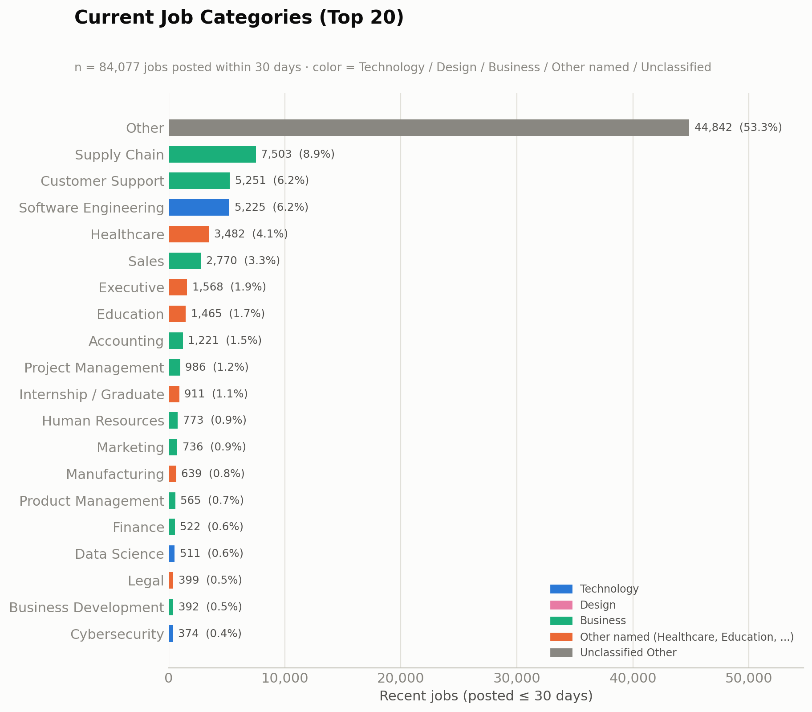

**Macro mix:** Technology = 7,753 jobs (9.2%), Design = 270 jobs (0.3%), Business = 22,076 jobs
(26.3%), other named categories (Healthcare, Education, Manufacturing, etc.) = 9,136 jobs (10.9%),
Unclassified Other = 44,842 jobs (53.3%).

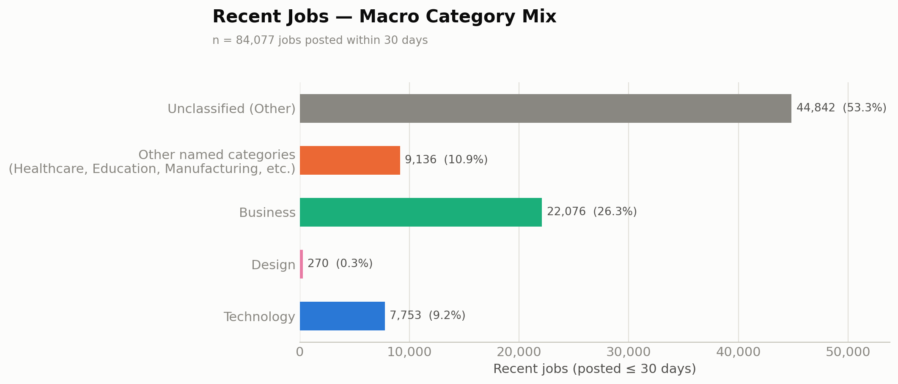

**Top hiring categories overall:** excluding Other, Supply Chain (8.9%), Customer Support (6.2%),
and Software Engineering (6.2%) lead, followed by Healthcare (4.1%) and Sales (3.3%).
**Top technology categories:** Software Engineering (6.2%) dominates by a wide margin, followed
by Data Science (0.6%), Cybersecurity (0.4%), AI/Machine Learning (0.4%), and QA/Testing (0.3%) —
Mobile (0.1%) and Frontend (0.1%) are the smallest technology sub-categories.
**Top non-technology categories:** Supply Chain (8.9%) and Customer Support (6.2%) are the
largest identifiable non-tech categories, followed by Healthcare (4.1%), Sales (3.3%), and
Executive (1.9%).

### 2. Current Jobs by Region

| Region | Recent Jobs | % of recent |
|---|---:|---:|
| United States | 39,124 | 46.5% |
| Europe | 15,721 | 18.7% |
| Other | 14,372 | 17.1% |
| United Kingdom | 6,925 | 8.2% |
| LATAM | 2,886 | 3.4% |
| Singapore / Southeast Asia | 1,744 | 2.1% |
| India | 1,656 | 2.0% |
| Canada | 1,649 | 2.0% |

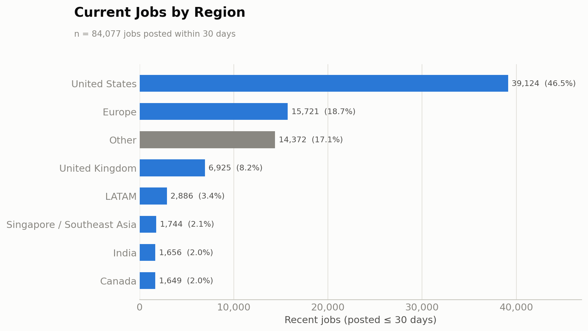

**Strongest current hiring activity:** the United States (46.5%) and Europe (18.7%) together
account for nearly two-thirds of recent postings; the UK (8.2%) is a distant third. Canada,
India, and Singapore/Southeast Asia are each near 2% — the weakest current hiring activity of
the eight regions, and consistent with the coverage gaps already identified in
`research/api_analysis.md`.

### 3. Current Jobs by Provider

| Provider | Recent Jobs | % of provider's own jobs that are recent |
|---|---:|---:|
| SmartRecruiters | 36,479 | 56.0% |
| Reed | 8,658 | 96.2% |
| Bundesagentur | 7,800 | 100.0% |
| USAJOBS | 6,138 | 61.4% |
| Other (SerpApi, OpenWeb Ninja, CareerJet, TheirStack, misc.) | 5,091 | 50.4% |
| Greenhouse | 5,013 | 33.6% |
| Jooble | 2,973 | 95.1% |
| Himalayas | 2,964 | 100.0% |
| Lever | 2,653 | 14.9% |
| Ashby | 1,688 | 32.6% |
| Adzuna | 1,467 | 73.3% |
| Workable | 1,232 | 29.6% |
| Arbeitnow | 930 | 100.0% |
| The Muse | 615 | 30.8% |
| Teamtailor | 176 | 38.6% |
| Jobicy | 100 | 100.0% |
| RemoteOK | 100 | 100.0% |

**Freshest-contributing providers:** Bundesagentur, Himalayas, Arbeitnow, RemoteOK, and Jobicy are
100% fresh (every job they return is ≤30 days old), followed by Reed (96.2%) and Jooble (95.1%).
The lowest freshness rates belong to Lever (14.9%), Workable (29.6%), The Muse (30.8%), Ashby
(32.6%), and Greenhouse (33.6%) — all full-board ATS fetches with no date filter available to
exclude old requisitions.

### 4. Current Hiring Companies

| Rank | Company | Recent Jobs | % of recent |
|---:|---|---:|---:|
| 1 | Domino's | 20,620 | 24.5% |
| 2 | AccorHotel | 3,397 | 4.0% |
| 3 | AECOM | 2,297 | 2.7% |
| 4 | Bosch Group | 1,900 | 2.3% |
| 5 | Veterans Health Administration | 1,675 | 2.0% |
| 6 | Anduril Industries | 817 | 1.0% |
| 7 | Northwestern Memorial Healthcare | 751 | 0.9% |
| 8 | Reed | 689 | 0.8% |
| 9 | SpaceX | 681 | 0.8% |
| 10 | Delivery Hero | 599 | 0.7% |
| 11 | eFinancialCareers | 514 | 0.6% |
| 12 | Primark | 454 | 0.5% |
| 13 | ASSYSTEM | 417 | 0.5% |
| 14 | Tesco | 396 | 0.5% |
| 15 | AUREA GmbH | 341 | 0.4% |
| 16 | Boyd Gaming | 335 | 0.4% |
| 17 | Munson Healthcare | 328 | 0.4% |
| 18 | NielsenIQ | 324 | 0.4% |
| 19 | Hays Specialist Recruitment Limited | 320 | 0.4% |
| 20 | Continental | 309 | 0.4% |

**Concentration:** hiring is concentrated among a few employers — the top 10 companies account
for 39.8% of recent postings and Domino's alone is 24.5% (up from 15.7% dataset-wide), because
Domino's board refreshes far more often than most ATS-hosted boards. There are 8,999 distinct
companies among recent postings, so the concentration coexists with a very long tail: most
companies with any recent activity have only one open posting.

### 5. Current Hiring Trends

**Methodology note:** `jobs.json` is a single point-in-time snapshot, so no true historical
(multi-run) trend can be computed. "Growth"/"momentum" below is proxied by comparing, within the
84,077 recent jobs, what share of each category's/region's own postings fall in the last 7 days
versus the 8–30 day window — a category whose recent activity skews more heavily toward the last
7 days is reported as trending up. This is a within-snapshot concentration signal, not a
month-over-month comparison, and is reported as such.

**Fastest-growing technical roles (share of category's recent jobs posted in the last 7 days):**

| Rank | Technology category | Jobs (≤30d) | Share posted in last 7 days |
|---:|---|---:|---:|
| 1 | Full Stack | 203 | 55.7% |
| 2 | DevOps | 276 | 53.3% |
| 3 | Cloud | 268 | 47.0% |
| 4 | Mobile | 47 | 46.8% |
| 5 | Backend | 197 | 46.2% |

**Fastest-growing non-technical roles:**

| Rank | Category | Jobs (≤30d) | Share posted in last 7 days |
|---:|---|---:|---:|
| 1 | Digital Marketing | 291 | 64.9% |
| 2 | Accounting | 1,221 | 55.7% |
| 3 | Human Resources | 773 | 55.6% |
| 4 | Business Development | 392 | 54.6% |
| 5 | Finance | 522 | 52.7% |

**Remote hiring trend:** the remote share is *lower* among recent jobs (9.7%) than among jobs
older than 30 days (12.3%) — a 2.6-point decline, suggesting onsite/hybrid postings are being
refreshed somewhat faster than remote ones in this dataset, not that remote hiring itself is
shrinking in the underlying job market.

**Regional hiring trend (recent share vs. overall dataset share):** Europe is +4.6 points
above its dataset-wide share (18.7% recent vs. 14.1% overall) and the UK is +1.6 points
(8.2% vs. 6.6%) — both regions are contributing a *larger* share of current activity than their
historical footprint. The United States is −4.0 points (46.5% vs. 50.5%) — still dominant, but
under-contributing to *recent* activity relative to its overall size. Canada, India, LATAM, and
Singapore/Southeast Asia are each slightly below their dataset-wide share (−0.2 to −1.0 points).

**Industries with the highest hiring activity:** based on the category and top-company data
above, food service/QSR (Domino's), hospitality (AccorHotel, Boyd Gaming), engineering/
construction consulting (AECOM, ASSYSTEM), automotive/industrial manufacturing (Bosch Group,
Continental), healthcare/government health systems (Veterans Health Administration, Northwestern
Memorial Healthcare, Munson Healthcare), aerospace/defense (Anduril Industries, SpaceX), and
staffing/recruiting (Reed, Hays Specialist Recruitment) are the industries driving the most
current hiring activity among the top 20 employers.

### 6. Business Insights

**If someone visited the platform today, they would mostly see:** retail, food-service, and
logistics/delivery roles (the Other and Supply Chain categories combined are 62.2% of recent
postings), driven overwhelmingly by one employer's multi-location board (Domino's, 24.5% of all
recent jobs).

**Which industries dominate:** food service/QSR, hospitality, healthcare, and engineering/
industrial consulting — per the top-20-company industry view above.

**Which technical skills dominate:** general Software Engineering (6.2% of all recent jobs, and
67% of all recent Technology-category jobs) dominates by far; Data Science, Cybersecurity, and
AI/Machine Learning are present but each under 0.7% of recent jobs — Technology overall is only
9.2% of current listings.

**Which non-technical roles dominate:** Supply Chain (logistics, delivery, warehouse — 8.9%) and
Customer Support (6.2%) are the largest identifiable non-technical categories, followed by
Healthcare (4.1%) and Sales (3.3%).

**Which regions have the most opportunities:** the United States (46.5%) and Europe (18.7%) offer
by far the most current opportunities; the UK (8.2%) is a distant third, and Canada, India, and
Singapore/Southeast Asia each offer comparatively few (~2% each).

### 7. Engineering Recommendations

- **Job categories requiring additional API coverage:** Technology (9.2% of recent jobs) and
  Design (0.3%) are thin relative to typical job-market composition, especially the granular
  sub-categories (Mobile 0.1%, Frontend 0.1%, Cloud 0.3%) — sourcing more from tech-focused
  boards/ATS company lists (already-integrated Greenhouse/Lever/Ashby cover many tech companies,
  but the curated slug lists could be grown specifically toward mobile, cloud, and design-heavy
  employers) would directly address this gap.
- **Regions requiring additional providers:** Canada, India, and Singapore/Southeast Asia are
  each near 2% of recent jobs and would benefit most from the already-identified, low-effort
  additions in `research/api_analysis.md` (multi-country Adzuna, MyCareersFuture, ATS slug
  expansion) — these regions are thin in both total volume (Regional Coverage, above) and in
  current/recent activity.
- **APIs that should be refreshed more frequently:** SmartRecruiters, Reed, Bundesagentur,
  USAJOBS, and Jooble — all high-freshness-rate, high-volume providers whose own inventories are
  already turning over quickly enough to justify daily (or more frequent) synchronization.
- **Providers that already provide sufficient recent jobs:** Bundesagentur, Himalayas, Arbeitnow,
  RemoteOK, Jobicy (100% fresh), plus Reed (96.2%) and Jooble (95.1%) — these require no
  freshness-focused engineering work.
- **Providers that should be optimized first:** Lever (14.9% fresh), Workable (29.6%), The Muse
  (30.8%), Ashby (32.6%), and Greenhouse (33.6%) — all five are large contributors to the overall
  dataset but contribute disproportionately to its *stale* tail; since none expose a request-side
  date filter, the fix is incremental synchronization (per-job first-seen/last-seen tracking) run
  ahead of any new API integration.

---

## Recommendations

*(Summarized here for management visibility; full reasoning, effort estimates, and a
prioritized roadmap are in `research/api_analysis.md` §§6, 14, and 19.)*

1. **Broaden regional balance**, particularly Canada, UK resilience, and Singapore/SEA, by
   extending already-integrated providers (e.g., enabling additional country configurations on
   existing keyed sources) rather than adding entirely new integrations.
2. **Introduce a refresh schedule and expiry mechanism** so the freshness ratio stops degrading
   between runs and dead/closed postings are retired automatically.
3. **Grow the ATS company-slug lists** for under-represented regions to rebalance provider and
   regional concentration without new integration work.
4. **Do not deduplicate on title+company alone** — doing so would remove tens of thousands of
   legitimate multi-location jobs (e.g., Domino's, BoxLunch); any future duplicate-reduction
   effort should be scoped conservatively (URL normalization plus location-aware matching).
5. **Improve location-text normalization** to shrink the 18.2% unclassifiable bucket and make
   regional filtering and reporting more reliable.
6. **Revisit the TheirStack account/plan** to restore its contribution, or formally retire it
   from the active provider list if the plan restriction is permanent.
7. **Monitor concentration risk**: with 41.8% of jobs from one provider and 15.7% from one
   company, any change to SmartRecruiters' Domino's board would materially shift dataset-wide
   statistics — worth tracking as a data-quality signal in future runs.

---

## Regional API Expansion Strategy

*(Note on table format: the requested Public/Government/Commercial/ATS and Free/Free Trial/Paid/
Enterprise flags are consolidated below into single "Type" and "Pricing" columns for
readability — every requested attribute is still answered, just as a categorical value rather
than four separate Yes/No columns. All figures are drawn from `research/api_analysis.md`
Sections 4, 5, 9, 10, 11, 17, 18, and 20; nothing below is a new estimate.)*

### United States

**Existing APIs already implemented**

*Table A — identity & access:*

| API Name | Type | Pricing | Auth | Docs |
|---|---|---|---|---|
| Adzuna (US) | Public/Commercial aggregator | Free tier (keyed) | Yes | Yes |
| USAJOBS | Government (US federal) | Free | Yes (3 headers) | Yes |
| Greenhouse/Lever/Ashby/SmartRecruiters/Workable/Teamtailor | ATS | Free (no auth) | No | Yes |
| Jooble/Careerjet/SerpApi/OpenWeb Ninja | Commercial aggregator | Free tier / Paid (metered) | Yes | Yes |

*Table B — capacity & recommendation:*

| API Name | Rate Limits / Pagination | Country Coverage | Expected Volume | Effort | Recommendation |
|---|---|---|---|---|---|
| Adzuna (US) | Free-tier daily cap; ≤ 50/page, no ceiling found | United States (configured) | ~2,000/run (self-capped) | Low | Keep; add date/category filters |
| USAJOBS | Hard 10,000 result window | US federal only | 10,000 (at cap) | Low | Keep; partition by category/location |
| Greenhouse/Lever/Ashby/SmartRecruiters/Workable/Teamtailor | None on most; some real pagination | US-heavy, some global | ~130,000+ combined | Low | Keep; grow curated company-slug lists |
| Jooble/Careerjet/SerpApi/OpenWeb Ninja | Varies; wildcard queries used today | Global (US-weighted) | ~1,100-2,000 each | Low | Keep; replace wildcard with targeted queries |

**Additional APIs that could improve coverage**

*Table A — identity & access:*

| API Name | Type | Pricing | Auth | Docs |
|---|---|---|---|---|
| CareerOneStop / NLx "List Jobs V2" | Government (US DOL, NLx) | Free (partner-gated) | Yes (token; approval needed) | Yes |
| Fantastic Jobs / Active Jobs DB | Commercial aggregator (ATS-sourced) | Free trial; ~$1/1,000 jobs | Yes | Yes |
| Coresignal | Enterprise/Commercial | Paid (from $49/mo) | Yes | Yes |

*Table B — capacity & recommendation:*

| API Name | Rate Limits / Pagination | Country Coverage | Expected Volume | Effort | Recommendation |
|---|---|---|---|---|---|
| CareerOneStop / NLx "List Jobs V2" | Not fully published | US, non-federal, national | Large (authoritative) | Medium | Investigate/Add if approved |
| Fantastic Jobs / Active Jobs DB | Generous; hourly refresh | US + English-speaking | 3M+/month globally | Low | Add if budget allows |
| Coresignal | Per plan | Global incl. US | 399M+ multi-source records | Medium | Enterprise-only; scale play |

### Canada

**Existing APIs already implemented**

*Table A — identity & access:*

| API Name | Type | Pricing | Auth | Docs |
|---|---|---|---|---|
| (none dedicated) | — | — | — | — |

*Table B — capacity & recommendation:*

| API Name | Rate Limits / Pagination | Country Coverage | Expected Volume | Effort | Recommendation |
|---|---|---|---|---|---|
| (none dedicated) | — | Incidental only, via global ATS boards | ~3,436 incidental (2.2%) | — | Not applicable — see below |

**Additional APIs that could improve coverage**

*Table A — identity & access:*

| API Name | Type | Pricing | Auth | Docs |
|---|---|---|---|---|
| Adzuna 'ca' | Public/Commercial aggregator | Free tier (existing key) | Yes (already held) | Yes |
| Job Bank (ESDC) feed / Open Gov dataset | Government (Canada) | Free (feed gated; dataset open) | Partner approval (feed); none (dataset) | Yes |
| ATS company-slug expansion (Canadian-HQ) | ATS | Free (no auth) | No | Yes |

*Table B — capacity & recommendation:*

| API Name | Rate Limits / Pagination | Country Coverage | Expected Volume | Effort | Recommendation |
|---|---|---|---|---|---|
| Adzuna 'ca' | Same pattern as US Adzuna | Canada | ~2,000/run | Trivial | Add — Critical priority |
| Job Bank (ESDC) feed / Open Gov dataset | Feed unknown; dataset refreshes monthly | Canada (national) | Very large (100,000+) | Medium-High | Investigate — authoritative, freshness-limited |
| ATS company-slug expansion (Canadian-HQ) | None/per-platform | Canada | Low thousands | Low | Add — complementary |

### United Kingdom

**Existing APIs already implemented**

*Table A — identity & access:*

| API Name | Type | Pricing | Auth | Docs |
|---|---|---|---|---|
| Reed | Public/Commercial (UK board) | Free tier (keyed) | Yes (Basic Auth) | Yes |

*Table B — capacity & recommendation:*

| API Name | Rate Limits / Pagination | Country Coverage | Expected Volume | Effort | Recommendation |
|---|---|---|---|---|---|
| Reed | ~9,900-job window (errors past boundary) | United Kingdom | ~9,000 (near ceiling) | Low | Keep; partition by region/keyword |

**Additional APIs that could improve coverage**

*Table A — identity & access:*

| API Name | Type | Pricing | Auth | Docs |
|---|---|---|---|---|
| Adzuna 'gb' | Public/Commercial aggregator | Free tier (existing key) | Yes (already held) | Yes |
| GOV.UK Find a Job (DWP) | Government (UK) | Free (access model unclear) | Unclear | Partial |
| Careerjet (UK locale) | Commercial aggregator (integrated) | Free tier (existing key) | Yes (already held) | Yes |

*Table B — capacity & recommendation:*

| API Name | Rate Limits / Pagination | Country Coverage | Expected Volume | Effort | Recommendation |
|---|---|---|---|---|---|
| Adzuna 'gb' | Same pattern as other Adzuna countries | United Kingdom | ~2,000/run | Trivial | Add — de-risks single-source dependency on Reed |
| GOV.UK Find a Job (DWP) | Unknown | United Kingdom (national) | Potentially large | Unclear | Investigate — confirm read-access model |
| Careerjet (UK locale) | 20/page fixed; no ceiling found | UK (via locale_code) | ~2,000/run | Low | Add — optional, modest gain |

### Europe

**Existing APIs already implemented**

*Table A — identity & access:*

| API Name | Type | Pricing | Auth | Docs |
|---|---|---|---|---|
| Bundesagentur für Arbeit | Government (Germany) | Free (public key) | Yes (non-secret key) | Yes |
| Arbeitnow | Public (EU/Germany-weighted) | Free (no auth) | No | Yes |
| Greenhouse/Lever/Ashby/Workable (incidental EU) | ATS | Free (no auth) | No | Yes |

*Table B — capacity & recommendation:*

| API Name | Rate Limits / Pagination | Country Coverage | Expected Volume | Effort | Recommendation |
|---|---|---|---|---|---|
| Bundesagentur für Arbeit | Hard 10,000 result window | Germany | 10,000 (at cap) | Low | Keep; partition by region/keyword |
| Arbeitnow | None found; full board fetched | Germany-weighted, some EU | ~930 (full board) | Low | Keep; already exhausted |
| Greenhouse/Lever/Ashby/Workable (incidental EU) | None/per-platform | EU (incidental) | Meaningful, uncounted precisely | Low | Keep; grow EU-company slugs |

**Additional APIs that could improve coverage**

*Table A — identity & access:*

| API Name | Type | Pricing | Auth | Docs |
|---|---|---|---|---|
| Adzuna multi-country (fr/es/nl/it/pl/at) | Public/Commercial aggregator | Free tier (existing key) | Yes (already held) | Yes |
| France Travail (ex-Pôle emploi) | Government (France) | Free (registration required) | Yes (OAuth2) | Yes |
| EURES | Government/EU-wide | Free (no supported pull API) | N/A | Partial |

*Table B — capacity & recommendation:*

| API Name | Rate Limits / Pagination | Country Coverage | Expected Volume | Effort | Recommendation |
|---|---|---|---|---|---|
| Adzuna multi-country (fr/es/nl/it/pl/at) | Same free-tier pattern per country | France, Spain, Netherlands, Italy, Poland, Austria | ~2,000/run per country | Trivial | Add — Critical, top European lever |
| France Travail (ex-Pôle emploi) | Not fully published | France | Very large (500,000+) | Medium | Add — authoritative French coverage |
| EURES | N/A | EU-wide (~3M jobs) | Very large if accessible | High | Not recommended — scraping-only today |

### India

**Existing APIs already implemented**

*Table A — identity & access:*

| API Name | Type | Pricing | Auth | Docs |
|---|---|---|---|---|
| (none dedicated) | — | — | — | — |

*Table B — capacity & recommendation:*

| API Name | Rate Limits / Pagination | Country Coverage | Expected Volume | Effort | Recommendation |
|---|---|---|---|---|---|
| (none dedicated) | — | Incidental only, via global ATS + wildcard aggregators | ~3,471 incidental (2.2%) | — | Not applicable — see below |

**Additional APIs that could improve coverage**

*Table A — identity & access:*

| API Name | Type | Pricing | Auth | Docs |
|---|---|---|---|---|
| ATS company-slug expansion (Indian-HQ) | ATS | Free (no auth) | No | Yes |
| India-scoped query on JSearch / SerpApi | Commercial aggregator (integrated) | Free tier / Paid (metered, existing keys) | Yes (already held) | Yes |
| National Career Service (data.gov.in) | Government (India) | Free (open dataset) | None (dataset) | Yes |
| Fantastic Jobs / Active Jobs DB | Commercial aggregator | Free trial; ~$1/1,000 jobs | Yes | Yes |

*Table B — capacity & recommendation:*

| API Name | Rate Limits / Pagination | Country Coverage | Expected Volume | Effort | Recommendation |
|---|---|---|---|---|---|
| ATS company-slug expansion (Indian-HQ) | None/per-platform | India | Low thousands | Low | Add — Critical, best free route |
| India-scoped query on JSearch / SerpApi | 200 req/mo (JSearch); 250 searches/mo (SerpApi) | India (via country filter) | Modest, budget-bound | Low | Add — cheapest India-specific volume |
| National Career Service (data.gov.in) | N/A — periodic bulk dataset | India (national) | Large in aggregate | Medium-High | Investigate — authoritative, freshness-limited |
| Fantastic Jobs / Active Jobs DB | Generous; hourly refresh | Global incl. India | Large (part of 3M+/mo global) | Low | Add if budget allows |

### Singapore / Southeast Asia

**Existing APIs already implemented**

*Table A — identity & access:*

| API Name | Type | Pricing | Auth | Docs |
|---|---|---|---|---|
| (none dedicated) | — | — | — | — |

*Table B — capacity & recommendation:*

| API Name | Rate Limits / Pagination | Country Coverage | Expected Volume | Effort | Recommendation |
|---|---|---|---|---|---|
| (none dedicated) | — | Incidental only, via global ATS + wildcard aggregators | ~4,629 incidental (3.0%) | — | Not applicable — see below |

**Additional APIs that could improve coverage**

*Table A — identity & access:*

| API Name | Type | Pricing | Auth | Docs |
|---|---|---|---|---|
| MyCareersFuture | Government (Singapore, GovTech) | Free (no auth) | No | Community-documented |
| ATS company-slug expansion (SEA-HQ) | ATS | Free (no auth) | No | Yes |
| Adzuna 'sg' | Public/Commercial aggregator | Free tier (existing key, if covered) | Yes (already held) | Yes |
| JobStreet / JobsDB (SEEK group) | Commercial (dominant SEA boards) | No public API (partner only) | N/A | N/A |

*Table B — capacity & recommendation:*

| API Name | Rate Limits / Pagination | Country Coverage | Expected Volume | Effort | Recommendation |
|---|---|---|---|---|---|
| MyCareersFuture | Unknown/none published; 100/page | Singapore | ~80,000+ available | Low | Add — Critical, top SEA priority |
| ATS company-slug expansion (SEA-HQ) | None/per-platform | Singapore + broader SEA | Low thousands | Low | Add — complementary |
| Adzuna 'sg' | Same pattern as other Adzuna countries | Singapore | ~2,000/run if available | Trivial | Add if available |
| JobStreet / JobsDB (SEEK group) | N/A | MY, ID, PH, SG, TH, VN | Very large if accessible | High | Not recommended — scraping-only |

### LATAM

**Existing APIs already implemented**

*Table A — identity & access:*

| API Name | Type | Pricing | Auth | Docs |
|---|---|---|---|---|
| (none dedicated) | — | — | — | — |

*Table B — capacity & recommendation:*

| API Name | Rate Limits / Pagination | Country Coverage | Expected Volume | Effort | Recommendation |
|---|---|---|---|---|---|
| (none dedicated) | — | Incidental only, mostly remote/nearshore | ~6,955 incidental (4.5%) | — | Not applicable — see below |

**Additional APIs that could improve coverage**

*Table A — identity & access:*

| API Name | Type | Pricing | Auth | Docs |
|---|---|---|---|---|
| Adzuna 'br' + 'mx' | Public/Commercial aggregator | Free tier (existing key) | Yes (already held) | Yes |
| Get on Board | Commercial (LATAM tech board) | Likely free/low-cost (unverified) | Likely yes | Advertised, not independently verified |
| Himalayas search endpoint (country filter) | Public (integrated, richer endpoint unused) | Free (no auth) | No | Yes |
| ATS company-slug expansion (LATAM-HQ) | ATS | Free (no auth) | No | Yes |

*Table B — capacity & recommendation:*

| API Name | Rate Limits / Pagination | Country Coverage | Expected Volume | Effort | Recommendation |
|---|---|---|---|---|---|
| Adzuna 'br' + 'mx' | Same pattern as other Adzuna countries | Brazil, Mexico | ~2,000/run per country | Trivial | Add — Critical, top LATAM lever |
| Get on Board | Unknown | LATAM (tech-focused) | Moderate (est. 5,000-20,000) | Low-Medium | Investigate/Add — one LATAM board with a confirmed real API |
| Himalayas search endpoint (country filter) | 20/page fixed; 90,000+ archive | Remote-LATAM (via country filter) | Subset of 90,000+ archive | Low | Add — cheap, reuses existing integration |
| ATS company-slug expansion (LATAM-HQ) | None/per-platform | LATAM | Low thousands | Low | Add — complementary |

---

## Existing Provider Optimization

Every currently implemented provider, analyzed for current volume, realistic ceiling, and the
specific mechanism by which additional jobs could be collected. Figures match
`research/api_analysis.md` Section 20 and this report's Maximum Coverage from Existing Providers
section exactly — nothing here is a new estimate.

| Provider | Current Jobs | Estimated Maximum | Additional Jobs Possible | Difficulty | Recommended Strategy |
|---|---:|---:|---:|---|---|
| Arbeitnow | 930 | ~950–1,000 | ~0–100 | N/A | None — full board already exhausted; no filter dimension exists |
| Himalayas | 3,000 | 13,000–23,000 | +10,000–20,000 | Low | Switch to `/search` endpoint; partition by country/category filters |
| RemoteOK | 100 | ~100 | ~0 | N/A | None confirmed; verify tag-scoped endpoints before assuming more |
| Jobicy | 100 | 300–500 | +200–400 | Low | Partition by geo/industry/tag filters across multiple queries |
| The Muse | 2,000 | 5,000–8,000 | +3,000–6,000 | Medium | Partition by category/location filters; consider an API key |
| Bundesagentur | 10,000 | 25,000–40,000 | +15,000–30,000 | Medium | Partition by region (radius/location) or keyword across multiple queries |
| Jooble | 1,129 | 4,000–9,000 | +3,000–8,000 | Low | Replace wildcard with targeted keyword and location searches |
| USAJOBS | 10,000 | 20,000–30,000 | +10,000–20,000 | Medium | Partition by category or location filters across multiple queries |
| **Adzuna** | **2,000** | **22,000–42,000** | **+20,000–40,000** | **Low** | **Query multiple country endpoints already covered by the existing key** |
| Reed | 9,000 | 17,000–24,000 | +8,000–15,000 | Medium | Partition by UK region (location filter) or keyword across multiple queries |
| SerpApi | 50 | ~2,500/mo (budget-bound) | Budget-dependent | Low | Reallocate quota to targeted location/date-filtered queries |
| OpenWeb Ninja | ~47 | ~200/mo (budget-bound) | Budget-dependent | Low | Reallocate quota toward country-filtered (e.g. India) queries |
| Careerjet | 2,000 | 7,000–12,000 | +5,000–10,000 | Low | Add locale/country-scoped passes plus real keyword searches |
| TheirStack | 0 | 0 (plan-gated) | 0 until plan restored | N/A | Resolve the account/billing restriction first |
| Greenhouse | 22,728 | 27,728–37,728 | +5,000–15,000 | Low | ATS company expansion — add curated company slugs (no query filters exist) |
| Lever | 17,755 | 22,755–27,755 | +5,000–10,000 | Low | ATS company expansion — add curated company slugs |
| Ashby | 5,171 | 7,171–10,171 | +2,000–5,000 | Low | ATS company expansion — source slugs outside AI/SaaS/FinTech |
| SmartRecruiters | 65,193 | 70,193–80,193 | +5,000–15,000 | Low | ATS company expansion — add slugs, weigh against concentration risk |
| Workable | 7,644 | 10,644–14,644 | +3,000–7,000 | Low | ATS company expansion — source slugs in staffing/consulting/fintech/healthcare |
| Teamtailor | 474 | 974–1,974 | +500–1,500 | Low | ATS company expansion — source additional career sites (highest candidate hit rate) |

**How additional jobs can be collected, mapped to technique:**

- **Multiple country endpoints:** Adzuna (10+ countries already covered by the existing key),
  Careerjet (`locale_code` for UK/India/Brazil/SEA locales).
- **Category searches:** The Muse (`category`), USAJOBS (`JobCategoryCode`), Himalayas
  (`/search` endpoint).
- **Company searches:** TheirStack (`company` filter, once plan-restored); all six ATS
  providers via company-slug expansion (their only lever, since none expose query filters).
- **Location filters:** Adzuna (`where`), Bundesagentur (`wo`), USAJOBS (`LocationName`), Reed
  (`locationName`), Himalayas (`/search`).
- **Keyword searches:** Jooble, Careerjet, Adzuna (`what`), Bundesagentur (`was`), USAJOBS
  (`Keyword`) — replacing today's wildcard/unscoped queries with real terms.
- **Date filters:** Adzuna (`max_days_old`), USAJOBS (`DatePosted`), Bundesagentur
  (`veroeffentlichtseit`), Jooble (`datecreatedfrom`), TheirStack (`posted_at_max_age_days`) —
  these improve freshness more than raw volume, but reduce wasted re-fetching of stale jobs.
- **Remote filters:** USAJOBS (`RemoteIndicator`), JSearch/OpenWeb Ninja
  (`remote_jobs_only`), SerpApi (`work_from_home`) — primarily a relevance/quality lever, not a
  volume lever.
- **Department filters:** not applicable as a *query* mechanism for any of the 20 providers —
  department/team is returned as *data* by several ATS providers (Ashby, SmartRecruiters,
  Workable) but is not offered as a request-side filter, so it cannot be used to expand volume.
- **Radius searches:** Bundesagentur (`umkreis`), Reed (`distance`), USAJOBS (`Radius`).
- **Multiple API queries (partitioning):** the core mechanism for every Category C provider —
  Adzuna, Bundesagentur, USAJOBS, Reed, The Muse, Himalayas, Jooble, Careerjet — since each hits
  a hard per-query result-window ceiling that only partitioning can exceed.
- **Incremental synchronization:** improves freshness and avoids wasted re-fetches rather than
  raw volume directly; most relevant where a genuine updated/date field already exists (Jooble
  `updated`, Greenhouse `updated_at`, USAJOBS if `ApplicationCloseDate` is extracted).
- **ATS company expansion:** the *only* lever for Greenhouse, Lever, Ashby, SmartRecruiters,
  Workable, and Teamtailor — none of the six expose any query filter, so growing their curated
  company-slug lists is the sole path to more volume from these six providers.

---

## Regional Coverage Improvement Plan

**Current state and gaps**

| Region | Current Coverage | Coverage Gaps | Best Existing Provider to Optimize |
|---|---|---|---|
| United States | Strong (51.0% of dataset; deepest ATS + federal coverage) | Coverage is broad but curated-company-driven, not query-driven | Adzuna (US) — add date/category filters |
| Canada | Weakest target region (2.2%, incidental only) | No dedicated source at all | Adzuna — enable `ca` country |
| United Kingdom | Well covered for its size (6.6–8.2%) but single-source | No resilience/backup source | Reed — partition by region/keyword |
| Europe | 14.0–18.7%, but 56% Germany-concentrated | Rest of Europe (FR/ES/NL/IT/PL) thin | Bundesagentur — partition by region |
| India | 2.2% incidental; 4th-largest country despite no dedicated source | No dedicated source; consumer boards have no public API | ATS providers — expand Indian-HQ slugs |
| Singapore / Southeast Asia | 3.0%, weakest alongside Canada | No dedicated source anywhere in SEA | ATS slug expansion (no dedicated provider exists to optimize) |
| LATAM | 4.5%, mostly remote/nearshore, not in-country | Real in-country volume (Brazil/Mexico) thin | Himalayas — use `/search` with country filter |

**Recommended action and priority**

| Region | Best New API to Integrate | Expected Increase | Engineering Effort | Business Value | Priority |
|---|---|---:|---|---|---|
| United States | CareerOneStop/NLx (authoritative non-federal) | +10,000–20,000 (if NLx approved) | Medium (partner approval) | Medium (already strong) | Medium |
| Canada | Job Bank Canada (ESDC) | +15,000–25,000 (Adzuna + ATS slugs combined) | Trivial (Adzuna) | Very High | **Critical** |
| United Kingdom | Adzuna `gb` | +10,000–17,000 | Low–Medium | High | High |
| Europe | Adzuna multi-country + France Travail | +25,000–42,000 combined | Low (Adzuna) to Medium (France Travail) | High | **Critical** |
| India | India-scoped JSearch query (cheapest lever) | +10,000–20,000 | Low | High | High |
| Singapore / Southeast Asia | MyCareersFuture (Singapore) | +15,000–20,000 | Low | Very High | **Critical** |
| LATAM | Adzuna `br` + `mx` | +10,000–15,000 | Trivial–Low | High | High |

---

## ROI Prioritization

All recommendations from this report — both existing-provider optimization and new-API
integration — ranked into five priority tiers.

| Priority | Recommendation Bundle | Estimated Additional Jobs | Engineering Effort | Maintenance Effort | Business Impact | Technical Complexity |
|---|---|---:|---|---|---|---|
| **P1** | Adzuna multi-country expansion (US-only → CA/GB/DE/FR/ES/NL/IT/PL/AT/BR/MX) | +20,000–40,000 | Low | Low | Very High | Low |
| **P2** | MyCareersFuture (Singapore) + ATS company-slug expansion (Canada/India/SEA/LATAM) | +25,000–45,000 combined | Low–Medium | Medium (ongoing slug curation) | Very High | Low |
| **P3** | Query partitioning on already-capped providers (Bundesagentur, USAJOBS, Reed, Himalayas, Jooble, Careerjet, The Muse) | +56,000–99,000 combined | Medium | Low–Medium | High | Medium |
| **P4** | Freshness/incremental-sync engineering (run-to-run diffing, date filters, scheduling) | +0 net-new (transforms the 46% stale problem) | Medium | Medium | Very High (data quality) | Medium |
| **P5** | New official/government APIs requiring approval (CareerOneStop/NLx, France Travail, Job Bank Canada feed, National Career Service India) | +20,000–40,000 combined if all approved | Medium–High (approval processes) | Medium | Medium–High | Medium–High |

### Management Summary

1. **Which existing APIs should be optimized first?** Adzuna (multi-country) is by far the
   single highest-leverage change, followed by Bundesagentur, USAJOBS, Reed, Himalayas, Jooble,
   and Careerjet — all already capped at a hard per-query result window with filters they don't
   yet use.
2. **Which APIs have already reached their practical limit?** Arbeitnow and RemoteOK — both
   Category A, with no further query-based lever available. TheirStack is at zero solely due to
   a billing restriction, not an API ceiling.
3. **Which new APIs should be integrated first?** MyCareersFuture (Singapore — no-auth, free,
   ~15,000+ potential) first, followed by Job Bank Canada and France Travail as the next tier
   (both authoritative but requiring partner approval or OAuth registration).
4. **Which regions need the most attention?** Canada and Singapore/Southeast Asia (both ~2–3%
   of the dataset with zero dedicated source), followed by India (no dedicated source despite
   being the 4th-largest country incidentally) and LATAM (mostly remote/nearshore rather than
   real in-country volume).
5. **Approximately how many additional jobs could realistically be collected before
   integrating completely new providers?** On the order of **75,000–140,000 additional jobs**
   are obtainable purely from the 8 already-integrated providers' untapped filter/partitioning
   capacity (Adzuna, Bundesagentur, USAJOBS, Reed, Himalayas, Jooble, Careerjet, The Muse) —
   this figure is established consistently across this report's Maximum Coverage from Existing
   Providers section and `research/api_analysis.md` Sections 14, 19, and 20.

---

## Recent Job Market Analysis (≤ 30 Days)

**Scope note:** every figure below is computed from the same **84,077-job** slice already
established in the Job Freshness section above (jobs posted within 30 days of the dataset's
2026-07-03 collection date — 54.0% of the full 155,794-job dataset). Jobs older than 30 days are
excluded entirely from this section. Categories and regions are computed directly from each job's
`title`/`location` text; provider is reconstructed from the job's URL host, consistent with the
methodology used throughout this report.

### 1. Job Category Distribution

Every recent job was classified into a business-friendly category using its title (and tags where
informative). The suggested taxonomy skews toward professional/technical roles; because this
dataset is heavily weighted toward retail, hospitality, food-service, and driving/logistics
postings (see Company Distribution below), a large share of recent jobs do not map cleanly onto
that taxonomy and are honestly reported as **Other** rather than forced into a poor-fitting bucket.

| Category | Recent Jobs | % of recent |
|---|---:|---:|
| Other | 44,858 | 53.4% |
| Supply Chain | 7,531 | 9.0% |
| Software Engineering | 5,571 | 6.6% |
| Customer Support | 5,264 | 6.3% |
| Healthcare | 3,505 | 4.2% |
| Sales | 2,888 | 3.4% |
| Executive | 1,570 | 1.9% |
| Education | 1,474 | 1.8% |
| Accounting | 1,224 | 1.5% |
| Project Management | 994 | 1.2% |
| Internship / Graduate | 911 | 1.1% |
| Manufacturing | 792 | 0.9% |
| Human Resources | 779 | 0.9% |
| Marketing | 755 | 0.9% |
| Product Management | 576 | 0.7% |
| Finance | 525 | 0.6% |
| DevOps / Cloud | 517 | 0.6% |
| Data Science / Analytics | 511 | 0.6% |
| Legal | 399 | 0.5% |
| Business Development | 392 | 0.5% |
| Cybersecurity | 374 | 0.4% |
| Administrative | 334 | 0.4% |
| Customer Success | 302 | 0.4% |
| AI / Machine Learning | 299 | 0.4% |
| Digital Marketing | 293 | 0.3% |
| Operations | 274 | 0.3% |
| Procurement | 272 | 0.3% |
| Recruiting | 250 | 0.3% |
| IT Support | 219 | 0.3% |
| UI / UX Design | 174 | 0.2% |
| Government | 102 | 0.1% |
| Pharmaceutical | 77 | 0.1% |
| Graphic Design | 71 | 0.1% |

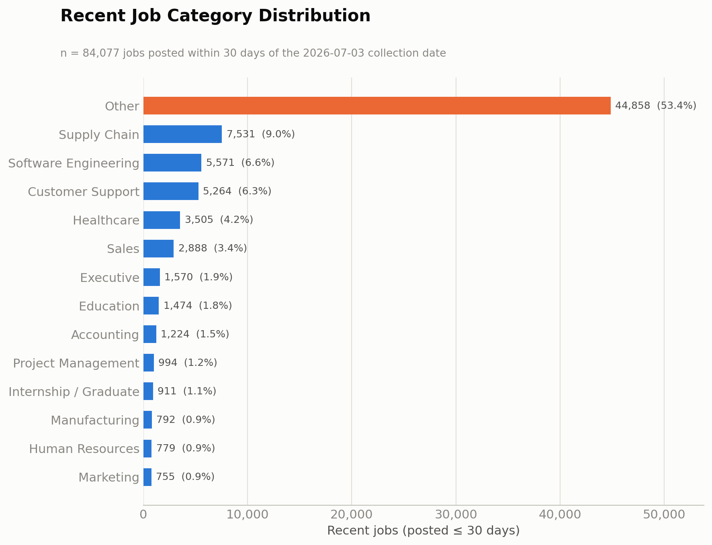

**Top hiring categories:** excluding the Other catch-all, **Supply Chain** (9.0% — driven by
delivery-driver and warehouse/despatch roles), **Software Engineering** (6.6%), and **Customer
Support** (6.3%) are the three largest identifiable categories among recent postings, followed by
**Healthcare** (4.2%) and **Sales** (3.4%). Inspection of the Other bucket confirms it is
dominated by retail, hospitality, and food-service titles (e.g., "Barista," "Tesco Colleague,"
"Kitchen Porter," "Assistant Manager") that fall outside the given professional/technical taxonomy
— this is a data-composition finding, not a classification gap.

### 2. Recent Jobs by Region

| Region | Recent Jobs | % of recent |
|---|---:|---:|
| United States | 39,124 | 46.5% |
| Europe | 15,721 | 18.7% |
| Other | 14,372 | 17.1% |
| United Kingdom | 6,925 | 8.2% |
| LATAM | 2,886 | 3.4% |
| Singapore / Southeast Asia | 1,744 | 2.1% |
| India | 1,656 | 2.0% |
| Canada | 1,649 | 2.0% |

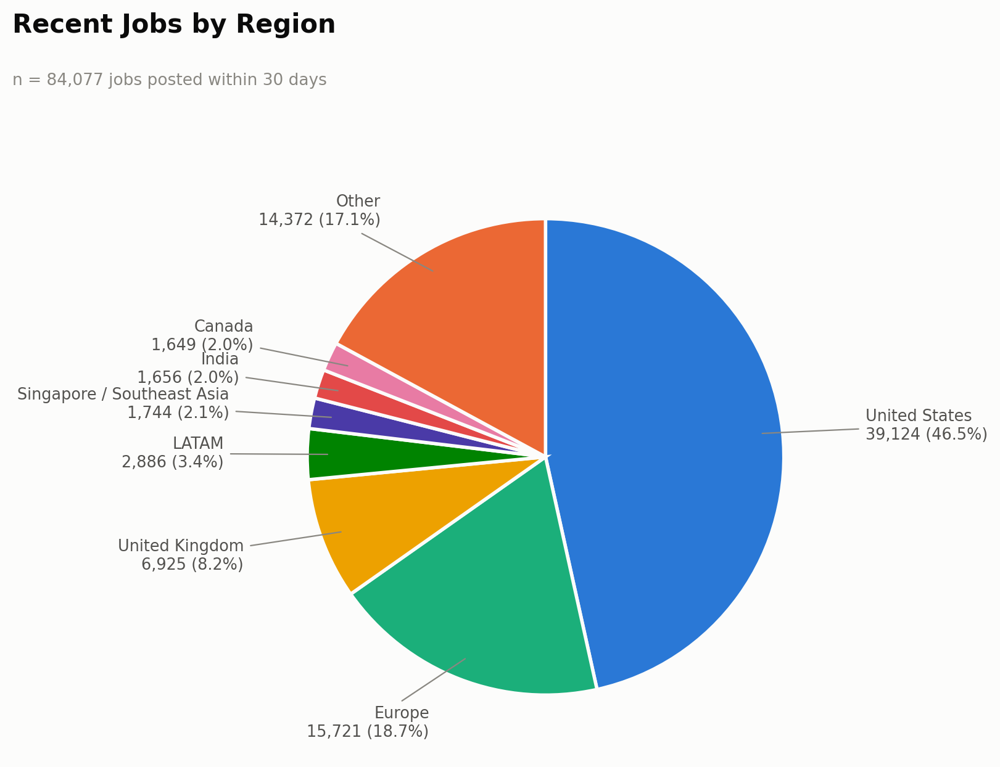

**Strongest current hiring activity:** the United States dominates recent postings (46.5%),
followed by Europe (18.7%, still Germany-heavy via Bundesagentur) and the UK (8.2%, almost
entirely Reed, which is 96.2% fresh — see below). Canada, India, and Singapore/Southeast Asia
each sit at only ~2% of recent volume — consistent with the regional coverage gaps already
identified in `research/api_analysis.md`, and a reminder that these regions are thin in *both*
total volume and freshness.

### 3. Recent Jobs by Provider

| Provider | Recent Jobs | % of recent | Freshness rate (share of provider's own total that is recent) |
|---|---:|---:|---:|
| SmartRecruiters | 36,479 | 43.4% | 56.0% |
| Reed | 8,658 | 10.3% | 96.2% |
| Bundesagentur | 7,800 | 9.3% | 100.0% |
| USAJOBS | 6,138 | 7.3% | 61.4% |
| Other (SerpApi, OpenWeb Ninja, CareerJet, TheirStack, misc.) | 5,091 | 6.1% | 50.4% |
| Greenhouse | 5,013 | 6.0% | 33.6% |
| Jooble | 2,973 | 3.5% | 95.1% |
| Himalayas | 2,964 | 3.5% | 100.0% |
| Lever | 2,653 | 3.2% | 14.9% |
| Ashby | 1,688 | 2.0% | 32.6% |
| Adzuna | 1,467 | 1.7% | 73.3% |
| Workable | 1,232 | 1.5% | 29.6% |
| Arbeitnow | 930 | 1.1% | 100.0% |
| The Muse | 615 | 0.7% | 30.8% |
| Teamtailor | 176 | 0.2% | 38.6% |
| Jobicy | 100 | 0.1% | 100.0% |
| RemoteOK | 100 | 0.1% | 100.0% |

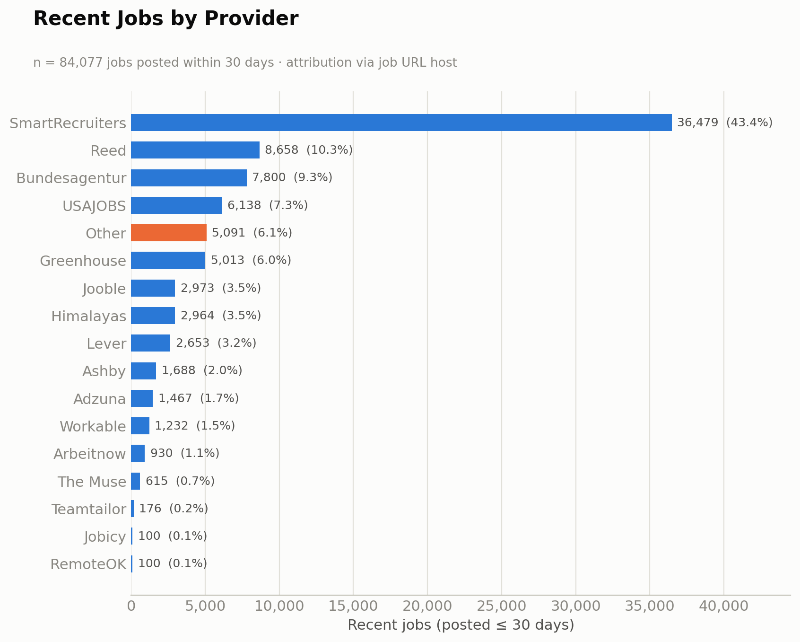

**Freshest-contributing providers:** by share of recent volume, SmartRecruiters (43.4%), Reed
(10.3%), and Bundesagentur (9.3%) contribute the most fresh jobs in absolute terms. By
**freshness rate** — the more diagnostic metric, showing what fraction of a provider's *own*
total inventory is recent — five providers are effectively 100% fresh: **Bundesagentur,
Himalayas, Arbeitnow, RemoteOK, and Jobicy**, all of which are newest-first, single-snapshot, or
short-window APIs by construction. **Reed (96.2%)** and **Jooble (95.1%)** are also excellent. At
the other end, **Lever (14.9%)**, **Workable (29.6%)**, **The Muse (30.8%)**, **Ashby (32.6%)**,
and **Greenhouse (33.6%)** have the lowest freshness rates — consistent with the earlier finding
that ATS boards return every currently open requisition, including long-standing evergreen roles,
regardless of when the pipeline last ran.

### 4. Recent Jobs by Company

| Rank | Company | Recent Jobs | % of recent |
|---:|---|---:|---:|
| 1 | Domino's | 20,620 | 24.5% |
| 2 | AccorHotel | 3,397 | 4.0% |
| 3 | AECOM | 2,297 | 2.7% |
| 4 | Bosch Group | 1,900 | 2.3% |
| 5 | Veterans Health Administration | 1,675 | 2.0% |
| 6 | Anduril Industries | 817 | 1.0% |
| 7 | Northwestern Memorial Healthcare | 751 | 0.9% |
| 8 | Reed | 689 | 0.8% |
| 9 | SpaceX | 681 | 0.8% |
| 10 | Delivery Hero | 599 | 0.7% |
| 11 | eFinancialCareers | 514 | 0.6% |
| 12 | Primark | 454 | 0.5% |
| 13 | ASSYSTEM | 417 | 0.5% |
| 14 | Tesco | 396 | 0.5% |
| 15 | AUREA GmbH | 341 | 0.4% |
| 16 | Boyd Gaming | 335 | 0.4% |
| 17 | Munson Healthcare | 328 | 0.4% |
| 18 | NielsenIQ | 324 | 0.4% |
| 19 | Hays Specialist Recruitment Limited | 320 | 0.4% |
| 20 | Continental | 309 | 0.4% |

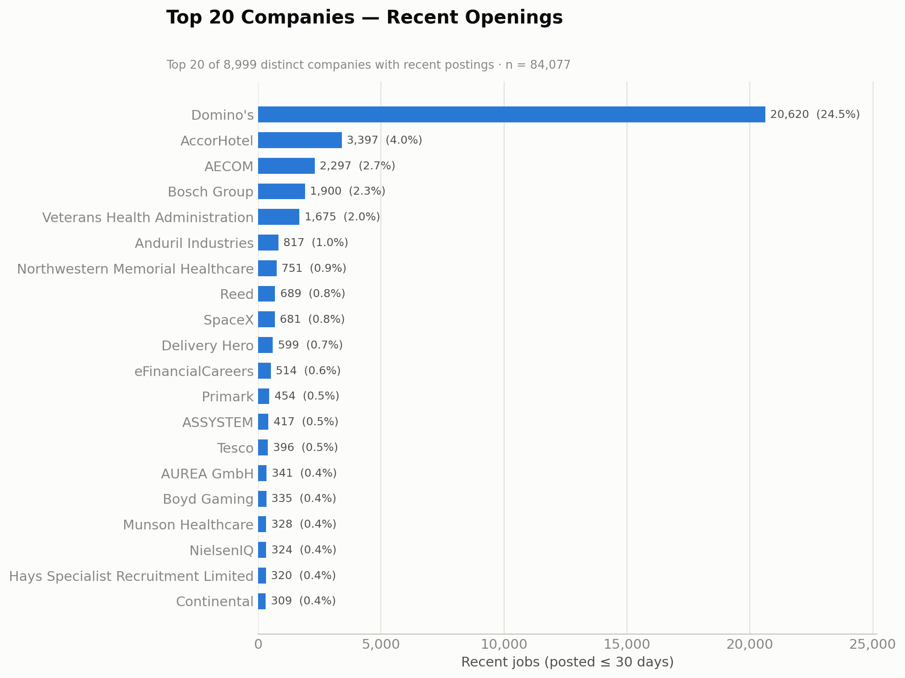

**Concentration:** recent hiring is **more concentrated than the dataset as a whole**. The top 10
companies account for 39.8% of all recent postings (vs. 37.8% dataset-wide), and Domino's alone
is 24.5% of every recent job — up from 15.7% dataset-wide — because Domino's postings refresh
very frequently (each store-level requisition is re-surfaced often), while many other large
employers' boards (e.g., Lever- and Greenhouse-hosted companies) contain a larger share of older,
still-open listings. There are 8,999 distinct companies among recent postings (vs. 9,497
dataset-wide), and the same bimodal pattern holds: a handful of very large, frequently-refreshed
employers alongside a long tail of single-posting companies.

### 5. Fresh Job Recommendations

- **APIs producing the freshest data:** Bundesagentur, Himalayas, Arbeitnow, RemoteOK, and Jobicy
  are effectively 100% fresh, because each either returns only newest-first results within a small
  window (Himalayas, Arbeitnow) or is a small, frequently-turning-over snapshot by construction
  (RemoteOK, Jobicy). Reed (96.2%) and Jooble (95.1%) are close behind.
- **Providers that mostly return older jobs:** Lever (14.9% fresh), Workable (29.6%), The Muse
  (30.8%), Ashby (32.6%), and Greenhouse (33.6%) skew toward stale inventory — all five are
  full-board ATS/API fetches that return every currently open requisition regardless of posting
  age, so a large share of what they return was already old at the time of the most recent run.
- **Providers that should be refreshed more frequently:** the same five low-freshness-rate
  providers (Lever, Workable, The Muse, Ashby, Greenhouse) benefit least from *more frequent runs
  alone*, since re-running them mainly re-fetches the same long-lived postings — for these, the
  fix is date-aware filtering or incremental sync (below), not just a tighter schedule.
- **Providers that should be synchronized daily:** the high-freshness-rate, high-volume providers
  — SmartRecruiters, Reed, Bundesagentur, USAJOBS, Jooble — justify a daily (or more frequent)
  sync, since their own APIs are already turning over quickly and a daily run would capture that
  turnover instead of losing it between longer intervals.
- **Providers that would benefit from incremental synchronization:** USAJOBS (`DatePosted`),
  Adzuna (`max_days_old`), Jooble (`datecreatedfrom`), Bundesagentur (`veroeffentlichtseit`), and
  TheirStack (`posted_at_max_age_days`, already partially used) all expose a genuine date-filter
  parameter today that is either unused or only partly used — these are the cheapest wins for
  incremental sync, since the capability already exists in the API (see
  `research/api_analysis.md`, Section 17).

### 6. Engineering Recommendations (Freshness-Focused)

- **Date filtering:** turn on the date filters already supported by USAJOBS, Adzuna, Bundesagentur,
  Jooble, and TheirStack to exclude stale postings at ingest time rather than after the fact —
  directly reduces the low freshness rates seen in this section without any new integration.
- **Incremental synchronization:** persist a per-job `first_seen`/`last_seen` watermark (using
  `createdAt`/`publishedAt`/`releasedDate`, already returned by every ATS provider) so runs can
  detect and retire postings that silently disappeared, rather than re-fetching a full board every
  time. This is the single biggest lever for the low-freshness ATS providers (Lever, Workable, The
  Muse, Ashby, Greenhouse), none of which expose a request-side date filter — the only path to
  "freshness" for these is diffing what changed between runs.
- **Region splitting:** partitioning broad, single-query providers (Adzuna, Bundesagentur, USAJOBS,
  Reed) by country/region multiplies effective coverage *and* lets each partition be scheduled and
  filtered independently by recency — a region that refreshes faster (e.g., UK via Reed) need not
  wait on a slower one.
- **Keyword searches:** replacing wildcard queries (Jooble, Careerjet, SerpApi, OpenWeb Ninja) with
  real, targeted keywords tends to surface different, often more recent, postings than a generic
  broad browse, and reduces duplication with other aggregators at the same time.
- **Company-based searches:** for the six ATS providers (Greenhouse, Lever, Ashby, SmartRecruiters,
  Workable, Teamtailor), freshness cannot be improved via query parameters — there are none — so
  the lever is exclusively adding/pruning company slugs and, more importantly, diffing each
  company's board run-over-run to detect closed postings.
- **Category searches:** partitioning The Muse, USAJOBS, and Himalayas by category alongside date
  ordering would let each category-specific query surface its own newest postings rather than
  being crowded out by a single large unfiltered result set.

**Estimated freshness improvement:** applying date filters and incremental sync to the five
providers identified above (USAJOBS, Adzuna, Bundesagentur, Jooble, TheirStack once restored) and
introducing run-over-run diffing for the five low-freshness ATS providers (Lever, Workable, The
Muse, Ashby, Greenhouse) would directly target the ~46,000 jobs in this dataset that are currently
older than 30 days despite coming from providers capable of returning newer results. A realistic
outcome is raising the **overall ≤30-day-fresh share from the current 54.0% into the high-60s to
low-70s percent range**, without adding a single new provider — the ceiling is bounded by how much
genuinely new inventory each provider's underlying job market produces per period, not by anything
in this pipeline.

---

## Provider Capability Matrix

*(Concise version - the full 8-part matrix with every heatmap and chart is in `final_project_report.docx`/`.pdf`. All figures below are computed directly from `jobs.json` using a rigorous provider-attribution method: URL host, cross-checked against each ATS source module's own curated company-slug list (`sources/greenhouse.py`, `lever.py`, `ashby.py`, `workable.py`, `teamtailor.py`, `smartrecruiters.py`) for cases where a provider's API returns the employer's own domain instead of the platform's - e.g. Greenhouse's `absolute_url` frequently points to `stripe.com`, not `boards.greenhouse.io`. This recovers **6,780** Greenhouse jobs and **~2,191** Bundesagentur jobs that a naive URL-host count would have misattributed. Region/category are computed with a location/title keyword classifier built for this section; the resulting totals differ modestly from the region/category figures elsewhere in this report because of classifier differences, not different underlying data. Only **1,125 jobs (0.7%)** remain genuinely unattributable to a specific provider.)*

### Part 1 - Provider Overview

| Provider | Total Jobs | % of Dataset | Primary Regions | Primary Categories | Remote % | Recent % (≤30d) | Auth Required | API Type |
|---|---:|---:|---|---|---:|---:|---|---|
| SmartRecruiters | 65,193 | 41.8% | United States, Other / Unclassified | Other, Operations | 3.0% | 56.0% | No (public posting endpoint) | ATS |
| Greenhouse | 21,722 | 13.9% | United States, Other / Unclassified | Other, Tech | 16.3% | 33.7% | No | ATS |
| Lever | 17,755 | 11.4% | United States, Other / Unclassified | Other, Sales | 19.8% | 14.9% | No (GET) | ATS |
| USAJOBS | 10,000 | 6.4% | United States | Other, Healthcare | 0.2% | 61.4% | Yes (3 headers) | Government |
| Bundesagentur | 9,991 | 6.4% | Germany, Europe (Other) | Other, Operations | 0.3% | 100.0% | Yes (public, non-secret key) | Government |
| Reed | 9,000 | 5.8% | United Kingdom | Other, Operations | 0.2% | 96.2% | Yes (HTTP Basic) | Commercial |
| Ashby | 5,171 | 3.3% | United States, Other / Unclassified | Other, Tech | 59.6% | 32.6% | No | ATS |
| Workable | 4,159 | 2.7% | United States, Singapore / SEA | Other, Tech | 28.5% | 29.6% | No (public widget API) | ATS |
| Jooble | 3,127 | 2.0% | United Kingdom, United States | Other, Operations | 0.2% | 95.1% | Yes (key in URL) | Commercial aggregator |
| Himalayas | 2,964 | 1.9% | United States, Other / Unclassified | Other, Tech | 100.0% | 100.0% | No | Public |
| Adzuna | 2,001 | 1.3% | United States, Other / Unclassified | Healthcare, Operations | 0.8% | 73.3% | Yes (app_id + app_key) | Commercial aggregator |
| The Muse | 2,000 | 1.3% | United States, Other / Unclassified | Other, Healthcare | 0.5% | 30.8% | No (key optional) | Public/Commercial aggregator |
| Arbeitnow | 930 | 0.6% | Germany, Other / Unclassified | Other, Tech | 14.3% | 100.0% | No | Public |
| Teamtailor | 456 | 0.3% | Other / Unclassified, Europe (Other) | Other, Operations | 24.8% | 38.6% | No (public RSS) | ATS |
| RemoteOK | 100 | 0.1% | Other / Unclassified, United States | Other, Tech | 100.0% | 100.0% | No (requires browser User-Agent) | Public |
| Jobicy | 100 | 0.1% | United States, Other / Unclassified | Other, Tech | 100.0% | 100.0% | No | Public |
| TheirStack | 0 | 0.0% | n/a (0 jobs) | n/a (0 jobs) | n/a | n/a | Yes (Bearer token) | Commercial (metered) |
| Unattributed | 1,125 | 0.7% | United States, Other / Unclassified | Other, Tech | 16.8% | 52.2% | Yes (mixed - SerpApi/OpenWeb Ninja/Careerjet) | Commercial aggregator (metered: SerpApi/OpenWeb Ninja/Careerjet) |

**Total: 155,794 jobs across 17 attributable buckets (16 named providers + 1,125 unattributable + TheirStack at 0).**

### Part 2 - Provider × Region (condensed)

Full 16×10 matrix and heatmap in the docx/pdf. Headline: SmartRecruiters, Greenhouse, and Lever are the only providers with meaningful **United States** volume at scale; Bundesagentur is Germany's near-exclusive source (93% of its own jobs); Reed and USAJOBS are single-country by construction (100% UK / 100% US respectively, per `research/api_analysis.md`); no provider reaches "Medium" or better on Canada, India, Singapore/SEA, or LATAM individually - every region outside the US/UK/Germany is served only incidentally.

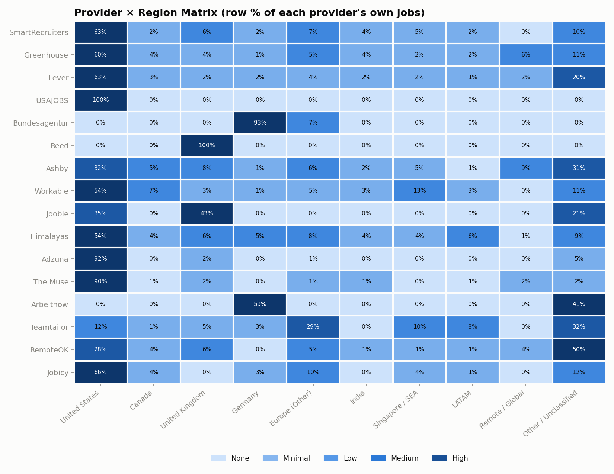

### Part 3 - Provider × Job Category (condensed)

Full 16×9 matrix and heatmap in the docx/pdf. Headline: SmartRecruiters is "High" on Operations (28%) and Customer Support (56% falls under Other/Operations combined - store-level retail/food-service roles); Greenhouse and Ashby are the only providers reaching "Medium/High" on Tech (24% each); Adzuna is unusually concentrated on Healthcare (69% of its own jobs, an artifact of how its wildcard query happened to run, not a deliberate healthcare focus).

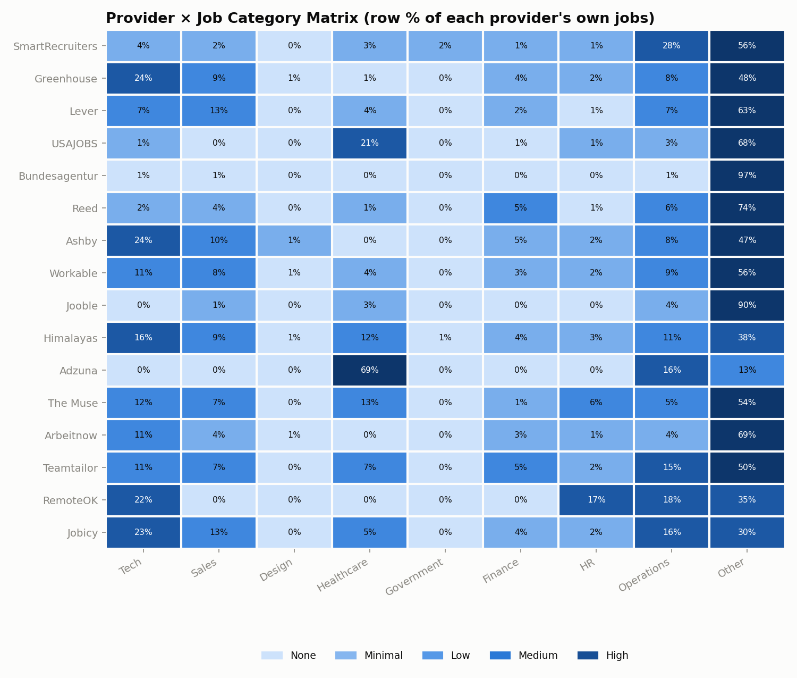

### Part 4 - Best Provider by Region

| Region | Best | 2nd | 3rd | Coverage Quality |
|---|---|---|---|---|
| United States | SmartRecruiters (40,781) | Greenhouse (13,088) | Lever (11,200) | Strong |
| Canada | SmartRecruiters (1,103) | Greenhouse (946) | Lever (495) | Weak |
| United Kingdom | Reed (9,000) | SmartRecruiters (3,761) | Jooble (1,352) | Strong but single-source-dependent |
| Europe | Bundesagentur (9,988) | SmartRecruiters (6,340) | Greenhouse (1,379) | Moderate, Germany-concentrated |
| India | SmartRecruiters (2,352) | Greenhouse (920) | Lever (356) | Weak |
| Singapore / SEA | SmartRecruiters (2,979) | Workable (559) | Greenhouse (361) | Weak |
| LATAM | SmartRecruiters (1,109) | Greenhouse (450) | Lever (240) | Weak, mostly remote/nearshore |

### Part 5 - Best Provider by Job Category

| Category | Best | 2nd | 3rd |
|---|---|---|---|
| Engineering | Greenhouse (3,117) | SmartRecruiters (957) | Ashby (671) |
| AI / ML | Greenhouse (443) | SmartRecruiters (153) | Lever (138) |
| Data | Greenhouse (445) | SmartRecruiters (391) | Lever (117) |
| DevOps | Greenhouse (527) | Ashby (232) | SmartRecruiters (231) |
| Cloud | SmartRecruiters (24) | Lever (20) | Reed (9) |
| Cybersecurity | Greenhouse (299) | SmartRecruiters (149) | Lever (120) |
| Design | Greenhouse (199) | SmartRecruiters (115) | Lever (75) |
| Sales | Lever (2,367) | Greenhouse (1,914) | SmartRecruiters (1,312) |
| Marketing | Greenhouse (288) | SmartRecruiters (132) | Lever (121) |
| Finance | SmartRecruiters (706) | Reed (446) | Greenhouse (289) |
| Healthcare | USAJOBS (2,058) | SmartRecruiters (1,685) | Adzuna (1,379) |
| Government | SmartRecruiters (1,478) | Greenhouse (33) | Lever (29) |
| HR | SmartRecruiters (656) | Greenhouse (390) | USAJOBS (124) |
| Operations | SmartRecruiters (8,073) | Greenhouse (1,225) | Lever (915) |
| Manufacturing | SmartRecruiters (771) | Greenhouse (460) | Lever (103) |
| Education | USAJOBS (518) | Reed (510) | SmartRecruiters (495) |
| Customer Support | SmartRecruiters (10,330) | Greenhouse (550) | Lever (369) |

### Part 6 - Provider Overlap Analysis (condensed)

**196 companies** (of several thousand distinct companies in the dataset) appear under more than one provider - a small, genuine cross-provider duplicate-risk pool, not a systemic problem. Every provider retains 80%+ company uniqueness (Bundesagentur 99.5%, USAJOBS 100%, Reed 97.6%), confirming the 16 providers are overwhelmingly **complementary**, not redundant. The clearest redundant pair is **Jooble ↔ Reed** (25 shared UK companies, ~186 duplicate-risk jobs) - both surface the same UK employers. The largest single duplicate exposure is **Greenhouse ↔ The Muse** (SpaceX, Riot Games, Flexport, Rent the Runway - 266 duplicate-risk jobs), because The Muse re-lists postings that already exist on those companies' own Greenhouse boards.

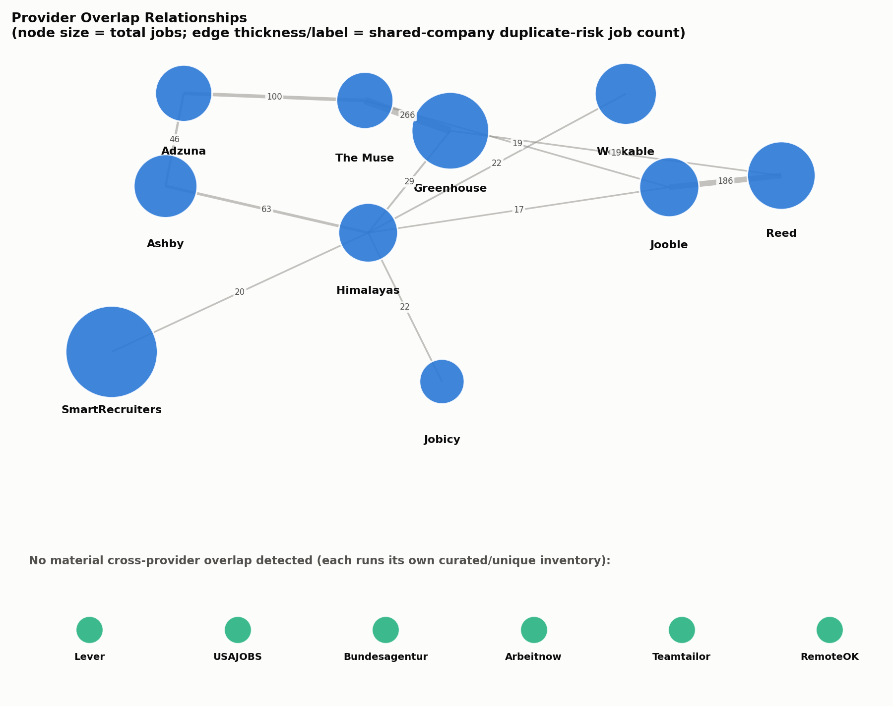

### Part 7 - Engineering Optimization Matrix (condensed)

| Provider | Current (verified) | Est. Max | Can Collect More? | Difficulty |
|---|---:|---:|---|---|
| SmartRecruiters | 65,193 | 70,193-80,193 | Yes | Low |
| Greenhouse | 21,722 | 27,000-38,000 | Yes | Low |
| Lever | 17,755 | 22,755-27,755 | Yes | Low |
| USAJOBS | 10,000 | 20,000-30,000 | Yes | Medium |
| Bundesagentur | 9,991 | 25,000-40,000 | Yes | Medium |
| Reed | 9,000 | 17,000-24,000 | Yes | Medium |
| Ashby | 5,171 | 7,171-10,171 | Yes | Low |
| Workable | 4,159 | 7,159-11,159 | Yes | Low |
| Jooble | 3,127 | 4,000-9,000 | Yes | Low |
| Himalayas | 2,964 | 13,000-23,000 | Yes | Low |
| Adzuna | 2,001 | 22,000-42,000 | Yes | Low |
| The Muse | 2,000 | 5,000-8,000 | Yes | Medium |
| Arbeitnow | 930 | 950-1,000 | No | N/A |
| Teamtailor | 456 | 956-1,956 | Yes | Low |
| RemoteOK | 100 | 100-100 | No | N/A |
| Jobicy | 100 | 300-500 | Yes | Low |

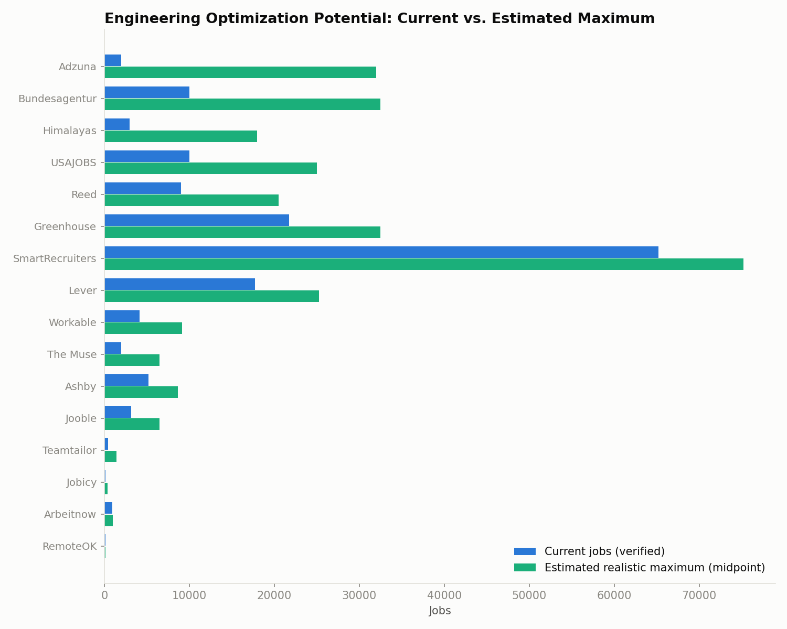

### Part 8 - Management Recommendations

1. **If we need more Engineering jobs, which providers should be optimized first?** Greenhouse first (already the #1 source at 3,117 of 6,158 engineering jobs) via curated slug growth, then Ashby (671) for the same reason - neither exposes a query filter, so slug expansion is the only lever.
2. **If we need more Sales jobs, which providers?** Lever first (2,367 of 7,377 sales jobs, its single largest fine category), then Greenhouse (1,914) - both via slug growth toward more go-to-market-heavy companies.
3. **If we need more Healthcare jobs, which providers?** USAJOBS first (2,058 jobs - federal health agencies, extractable via `JobCategoryCode`), then SmartRecruiters (1,685, hospital-system boards) via slug growth, and Adzuna (1,379) by turning its wildcard query into a healthcare-scoped one.
4. **If we need more Government jobs, which providers?** SmartRecruiters overwhelmingly (1,478 of 1,580) via government-contractor slug growth; USAJOBS is the only *authoritative* federal source and should be the long-term anchor even though its current title-keyword government-tag volume is small.
5. **If we need more Canada jobs, which providers?** None of the 16 providers target Canada specifically today. Enabling Adzuna's existing key against the `ca` country index is the fastest, lowest-effort lever (zero new integration); ATS slug growth toward Canadian-HQ companies is the complementary long-term lever.
6. **If we need more UK jobs, which providers?** Reed is already the dedicated UK source (9,000 jobs) and should be partitioned by region/keyword to push past its ~9,900-result ceiling; Adzuna `gb` is the fastest way to add a second UK source and reduce single-source dependency.
7. **If we need more Europe jobs, which providers?** Bundesagentur is already the anchor (9,988 jobs, Germany/Austria) and should be partitioned by region/keyword to push past its 10,000-result cap; Adzuna multi-country (fr/es/nl/it/pl/at) is the fastest way to spread Europe beyond German-agency concentration.
8. **If we need more India jobs, which providers?** No provider targets India specifically (all 2,352+ incidental India jobs ride on SmartRecruiters/Greenhouse slugs that happen to have Indian offices). ATS slug growth toward India-HQ companies is the cheapest lever; India-scoped SerpApi/JSearch queries are a fast secondary option.
9. **Which providers already provide excellent coverage?** SmartRecruiters (US, Operations, Customer Support), Bundesagentur (Germany, 100% fresh), Reed (UK, 96.2% fresh), and USAJOBS (US federal, government/healthcare) each already anchor their strongest region/category with high absolute volume and need no new integration - only partitioning of their existing, already-capped queries.
10. **Which providers should receive future engineering effort?** The six ATS providers (Greenhouse, Lever, Ashby, SmartRecruiters, Workable, Teamtailor) for company-slug expansion (their only lever), plus Adzuna for multi-country expansion (the single highest-leverage change available, per the ROI Prioritization section above) and Bundesagentur/USAJOBS/Reed/Himalayas/Jooble for query partitioning past their existing result-window caps.