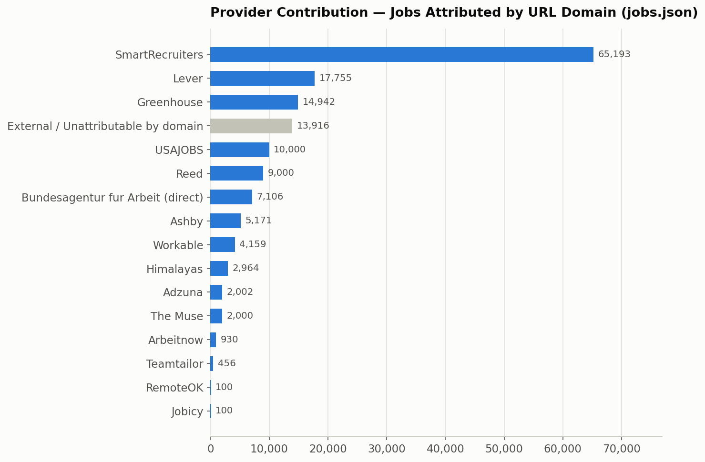
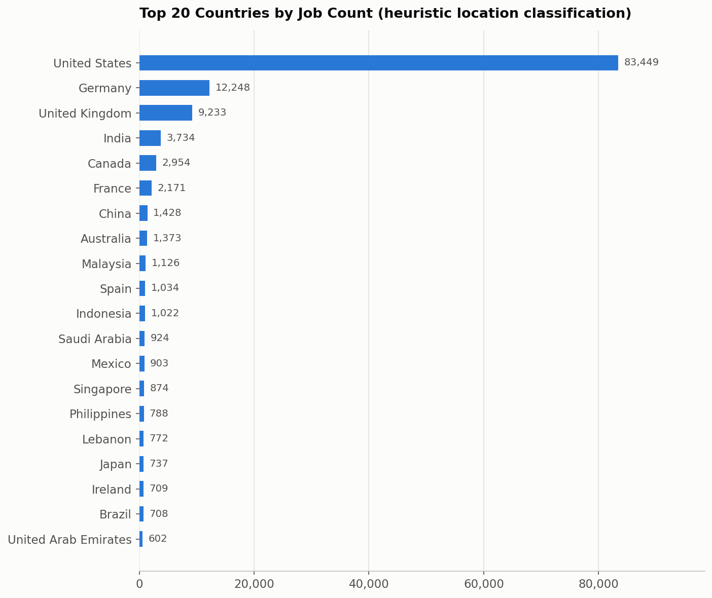
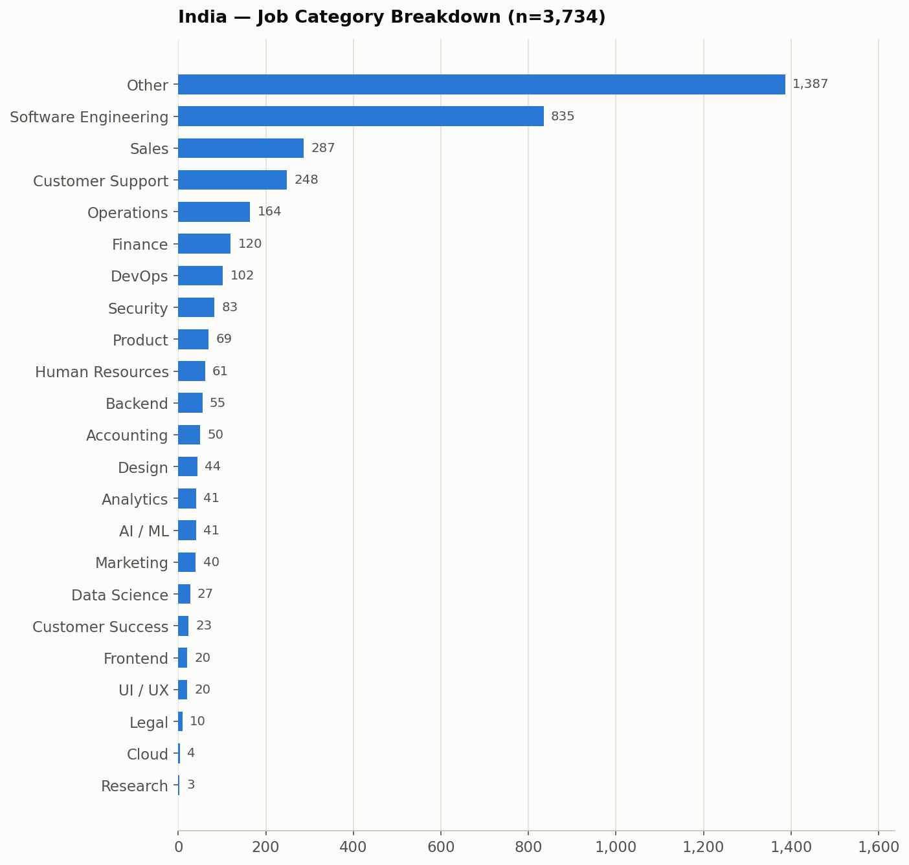
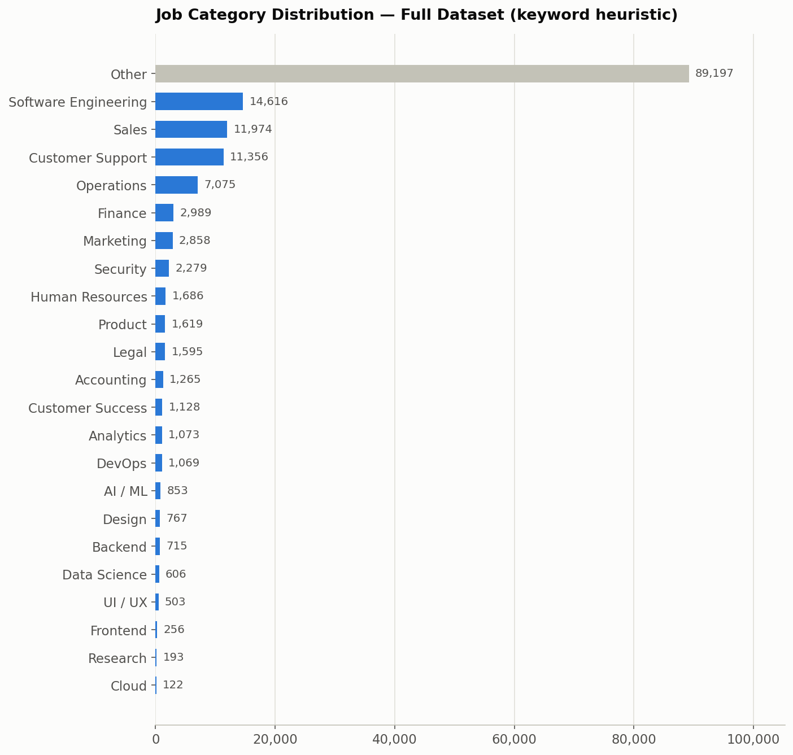
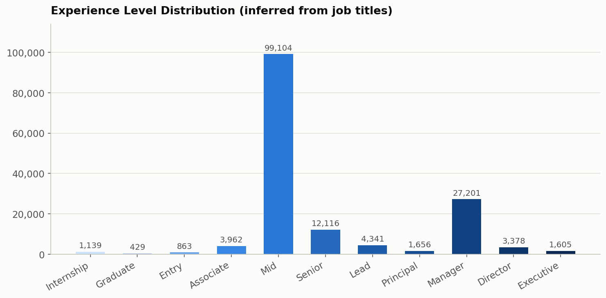
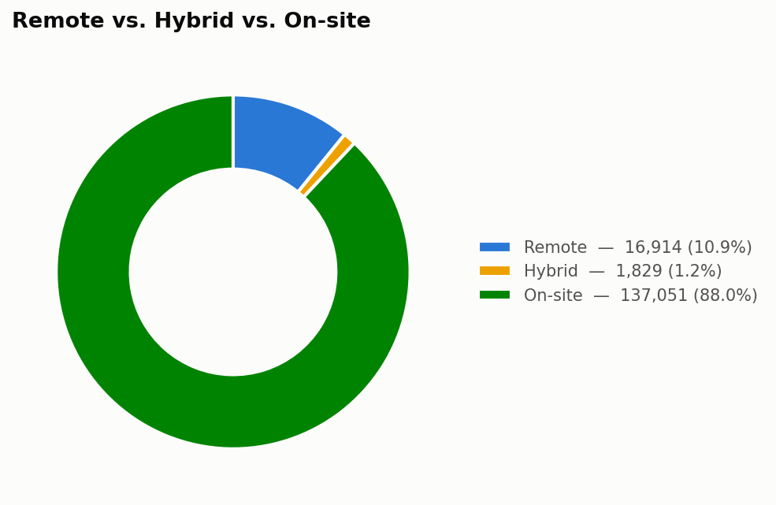
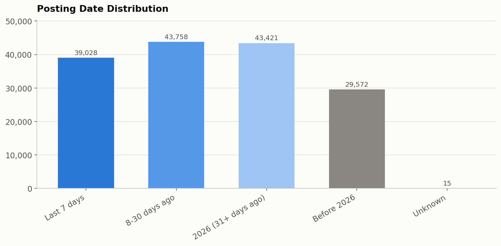
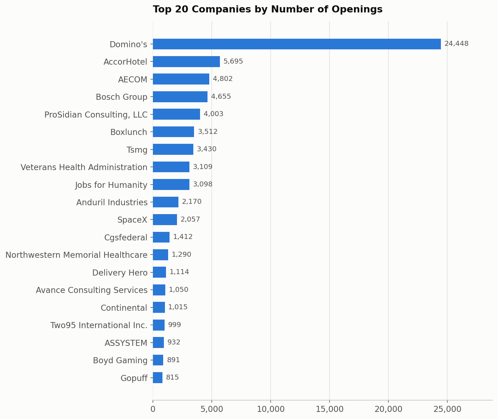
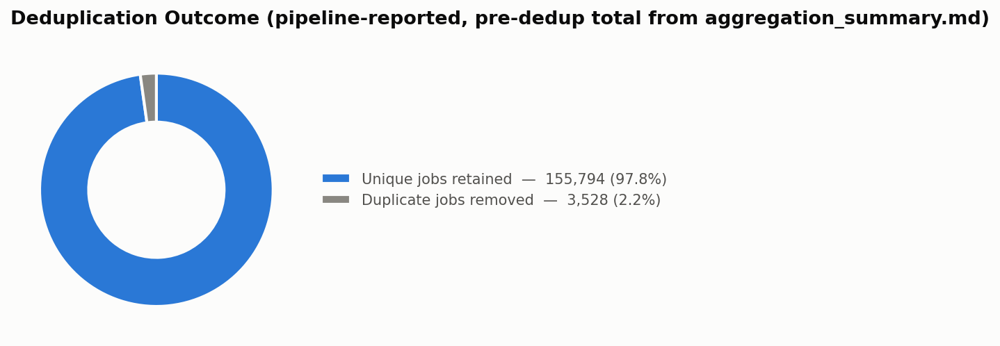

# Job Aggregation Platform

## Final Project Report

**Prepared by:** Prerna Anand
**Date:** July 4, 2026
**Dataset analyzed:** `jobs.json` (155,794 records, as currently present in the repository)

---

### Project Summary

The Job Aggregation Platform is a modular Python pipeline that fetches job postings from 20 independent providers — public no-auth APIs, API-key-based job-search APIs, and applicant-tracking-system (ATS) job boards — normalizes every posting into one common schema, deduplicates the combined result by URL, and serves it through a static HTML/CSS/JavaScript job board. The backend (`jobs.py`, `sources/`) and frontend (`index.html`, `script.js`, `style.css`) are complete. This report analyzes the dataset the pipeline produced, `jobs.json`, exactly as it exists on disk today, without re-running the pipeline or modifying any project file.

All figures in this report are either (a) computed directly from `jobs.json` by a read-only analysis script, or (b) cited from the project's own existing documentation (`README.md`, `aggregation_summary.md`), and are labeled accordingly. Nowhere are numbers estimated or invented. Several sections rely on heuristic classification (country, job category, experience level, work mode) because `jobs.json`'s schema does not store those fields directly — the methodology and accuracy limits of each heuristic are stated explicitly in its section.

---

## Executive Summary

**Project objective.** Build a single, normalized, de-duplicated job dataset by aggregating postings from as many distinct public/API/ATS job sources as feasible, and present it through a fast, filterable, client-side job board — without any source needing paid infrastructure, a backend server for the frontend, or a database.

**Final achievements.**
- 20 providers integrated across three phases (6 no-auth public APIs, 8 API-key providers, 6 ATS integrations), each as a self-contained module implementing a shared `BaseJobSource` interface.
- A single aggregation pipeline (`jobs.py`) fetches, normalizes, deduplicates, and validates all sources into one `jobs.json` file.
- A complete static frontend (search, location filter, sorting, debouncing, loading/error states) reads that file directly.
- The dataset currently on disk contains **155,794 unique, schema-valid job postings** with **zero duplicate URLs remaining**.

**Overall architecture.** Every provider is a self-contained module under `sources/` that implements `fetch_raw()` (talk to the provider's API) and `normalize()` (map its response onto the project's 7-field common schema). `jobs.py` never needs to change when a provider is added — it just imports the registry in `sources/__init__.py` and runs every registered source. This is the same modular pattern across all three integration phases.

**Total providers integrated:** 20 (per `README.md` / `aggregation_summary.md`).

**Total unique jobs (current `jobs.json`):** 155,794.

**Total distinct companies (computed):** 9,496.

**Remote jobs (computed, `remote: true` field):** 16,992 (10.9% of all jobs).

**Key accomplishments:**
- Three integration phases completed end-to-end (no-auth → API-key → ATS), each verified against live endpoints before being wired into the registry.
- URL-based deduplication with zero duplicate URLs remaining in the final file (verified independently in this analysis — see [Duplicate Analysis](#duplicate-analysis)).
- Per-source error isolation (`BaseJobSource.run()`) so one broken provider cannot take down the whole pipeline run.
- A reliability fix for Bundesagentur für Arbeit (retry with exponential backoff, raised timeout) documented in the project's own change history.
- A fully tested static frontend (manual + Playwright) layered on top of the aggregated dataset with no backend dependency.

---

## Project Architecture

**`BaseJobSource` architecture.** `sources/base.py` defines an abstract base class with two required methods — `fetch_raw()` (returns the provider's raw records) and `normalize()` (maps one raw record onto the shared schema) — plus a concrete `run()` method that calls both, catches and logs any exception per-source, and returns a normalized list. Every provider module subclasses this once; `jobs.py` only ever calls `.run()` on each entry in the registry.

**Provider abstraction.** Because the interface is limited to "give me raw records" and "normalize one record," it accommodates very different underlying integration shapes without special-casing in the pipeline: a single-page snapshot API (RemoteOK, Jobicy), a fully cursor/offset-paginated API (Arbeitnow, Bundesagentur, SmartRecruiters), and a company-by-company ATS crawl (Greenhouse, Lever, Ashby, Workable, Teamtailor, SmartRecruiters) are all just different `fetch_raw()` implementations behind the same contract.

**Aggregation pipeline.** `jobs.py` performs four steps in sequence: (1) `collect_all_jobs()` calls `.run()` on every source in `sources.SOURCES` and concatenates the results; (2) `dedupe_jobs()` removes duplicates keyed on the normalized `url` field, first occurrence wins; (3) a schema-validation pass (documented in `aggregation_summary.md`) confirms every record has exactly the 7 required fields with correct types; (4) `save_jobs()` writes the result to `jobs.json` as indented UTF-8 JSON.

**Normalization.** Every provider maps its own field names, date formats (Unix timestamps, ISO-8601, RFC 822/2822), and remote/hybrid signals onto one common schema:

```json
{
  "title": "",
  "company": "",
  "location": "",
  "url": "",
  "tags": [],
  "remote": true,
  "posted": ""
}
```

Verified directly against the current `jobs.json`: **100% of the 155,794 records (155,794 / 155,794) contain all 7 required fields with correct types** — the schema-validity check documented in the project's pipeline passes on the file as it exists today.

**Deduplication.** Jobs are deduplicated by `url` — the one field guaranteed to identify a specific posting uniquely, including cases where a company's ATS board lists the same job more than once (e.g., a Workable posting open across multiple cities). Verified directly against the current file: **0 duplicate URLs remain** among the 155,794 records.

**Reliability improvements.** Bundesagentur für Arbeit's requests now retry up to 3 times with exponential backoff (2s, then 4s) on timeouts/connection errors, and its per-request timeout was raised from 15s to 30s, after live runs surfaced transient read timeouts around page 20–50 (documented in `aggregation_summary.md`).

**Output generation.** The final list is serialized to `jobs.json` (52 MB, 155,794 records) and consumed as a static asset by the frontend via `fetch()`.

### Workflow Diagram

```
        ┌────────────────────────────────────────────────────────────┐
        │                     sources/__init__.py                     │
        │              SOURCES = [Arbeitnow, Himalayas, ... ]          │
        │            (6 Public APIs · 8 API-Key APIs · 6 ATS)          │
        └───────────────────────────┬────────────────────────────────┘
                                     │  for each source: source.run()
                                     ▼
        ┌────────────────────────────────────────────────────────────┐
        │  fetch_raw()  →  provider-specific HTTP request(s)           │
        │  normalize()  →  map onto common 7-field schema               │
        │  run()        →  isolates per-source failures, logs & skips  │
        └───────────────────────────┬────────────────────────────────┘
                                     │  concatenated normalized jobs
                                     ▼
        ┌────────────────────────────────────────────────────────────┐
        │             jobs.py :: collect_all_jobs()                    │
        └───────────────────────────┬────────────────────────────────┘
                                     ▼
        ┌────────────────────────────────────────────────────────────┐
        │            jobs.py :: dedupe_jobs()  (dedupe by url)          │
        └───────────────────────────┬────────────────────────────────┘
                                     ▼
        ┌────────────────────────────────────────────────────────────┐
        │           Schema validation (7 fields, correct types)        │
        └───────────────────────────┬────────────────────────────────┘
                                     ▼
        ┌────────────────────────────────────────────────────────────┐
        │            jobs.py :: save_jobs() → jobs.json (155,794)      │
        └───────────────────────────┬────────────────────────────────┘
                                     ▼
        ┌────────────────────────────────────────────────────────────┐
        │   index.html + script.js + style.css (static frontend)       │
        │   fetch("jobs.json") → search / filter / sort / render        │
        └────────────────────────────────────────────────────────────┘
```

---

## Provider Analysis

The table below lists all 20 integrated providers. **"Jobs Fetched"** is the pre-deduplication, per-provider figure recorded in the project's own `aggregation_summary.md` from its most recent full documented pipeline run — `jobs.json` itself does not store a per-record source/provider field, so this column is cited from existing project documentation rather than recomputed from the dataset (see the accuracy note in [Provider Contribution](#provider-contribution) for why an exact recomputation from `jobs.json` alone is not fully possible).

| # | Provider | Category | Authentication | Jobs Fetched (documented run) | Advantages | Limitations | Status |
|---|---|---|---|---|---|---|---|
| 1 | Arbeitnow | Public API | None | 931 | Clean, fully cursor-paginated REST API; no meaningful limits encountered | Smaller absolute volume than larger indexes | Active |
| 2 | Himalayas | Public API | None | 3,000 | Large remote-job archive (90,000+ reported) | `limit` param ignored server-side (fixed 20/page); pagination capped at 150 pages by design to stay recency-focused | Active |
| 3 | RemoteOK | Public API | None (requires browser-like User-Agent) | 100 | Simple, fast single-request snapshot | No pagination at all; blocks requests without a standard User-Agent | Active |
| 4 | Jobicy | Public API | None | 100 | Simple single-request snapshot | No pagination; rejects unsupported params with HTTP 400 rather than ignoring them | Active |
| 5 | The Muse | Public API | None | 2,000 | Broad company coverage | Public (unauthenticated) tier hard-caps at page 99 (400 error beyond), despite 400,000+ jobs reported as available | Active |
| 6 | Bundesagentur für Arbeit | Public API | Public non-secret API key header | 10,000 | Official German federal job index; very large volume | Hard `page*size ≤ 10,000` result-window ceiling; some transient timeouts mitigated with retry/backoff | Active |
| 7 | Jooble | API-Key | API key in URL path | 1,129 | Broad aggregator coverage across many external boards | Real usable result window for a broad query is much smaller than the reported match count; requires a non-empty keyword | Active |
| 8 | USAJOBS | API-Key | 3 auth headers (`Host`, `User-Agent`, `Authorization-Key`) | 10,000 | Official U.S. federal postings; genuine `remote` field (not inferred) | Reachable result window caps at exactly 10,000 regardless of page size | Active |
| 9 | Adzuna | API-Key | App ID + App key (query params) | 2,000 | No pagination ceiling found in testing; clean structured response | `results_per_page` silently capped at 50; country-scoped (one query per country) | Active |
| 10 | Reed | API-Key | HTTP Basic Auth (key as username) | 9,000 | High-volume UK job board | Hits a hard result-window boundary that returns HTTP 500 rather than an empty page; no job-category field, so `tags` is always empty | Active |
| 11 | SerpApi | API-Key (paid, metered) | API key (query param) | 50 | Google Jobs aggregation; broad cross-source coverage | Free tier: 200 searches/month; deliberately capped at 5 pages to conserve quota; only relative posting dates available | Active |
| 12 | OpenWeb Ninja (JSearch) | API-Key (paid, metered) | API key (header) | 47 | Aggregates listings from many external job sites | Free tier: 200 requests/month; deliberately capped at 5 pages; account required a subscription-tier fix before working | Active |
| 13 | CareerJet | API-Key | Affiliate ID + allowlisted IP + `Referer` header | 2,000 | No pagination ceiling found in testing | Requires dashboard-side IP allowlisting undocumented in the reviewed docs; `page_size` param silently ignored | Active |
| 14 | TheirStack | API-Key (paid) | API key (header) | 0 | Jobs-search endpoint with fine-grained filters | Current account plan returns HTTP 402 (Payment Required) for all requests — a billing/plan restriction, not a code defect | **Blocked (0 jobs, current plan)** |
| 15 | Greenhouse | ATS | None | 22,728 | No auth, no pagination needed, single request per company board; company name provided directly | Only covers companies explicitly configured in the source list | Active |
| 16 | Lever | ATS | None (GET) | 17,755 | Real offset/limit pagination available if ever needed | No company display-name field on job objects — name is derived from URL slug | Active |
| 17 | Ashby | ATS | None | 5,171 | Clean public API; genuine `isRemote` boolean | No company name field at all — requires a manually verified name mapping per company | Active |
| 18 | SmartRecruiters | ATS | None | 65,193 | Largest ATS contributor; real pagination for very large boards (e.g., Domino's: 24,000+) | Unknown/empty company IDs return HTTP 200 with an empty result rather than 404 — existence must be checked via `totalFound` | Active |
| 19 | Workable | ATS | None (public widget API) | 7,644 | Simple single-request-per-company fetch; company name provided directly | Some jobs list once per posted city under the same URL — resolved by the pipeline's own URL-based dedup | Active |
| 20 | Teamtailor | ATS | None (public RSS feed) | 474 | No API key required at all via the public `jobs.rss` feed | No usable public JSON API; some companies only resolve on the `.na.teamtailor.com` regional subdomain; RFC 822 dates need conversion | Active |

*Note: "Status" reflects each provider's condition as documented in the project's own aggregation history; it is not independently re-verified in this report since no network requests were made.*

---

## API Comparison

**Public APIs (Arbeitnow, Himalayas, RemoteOK, Jobicy, The Muse, Bundesagentur für Arbeit).** No credentials required at all, so they are the most operationally resilient tier — nothing to expire, rotate, or run out of quota. Coverage varies widely: Bundesagentur is a large, single-country (Germany) government index; Arbeitnow, Himalayas, and The Muse are general multi-company boards; RemoteOK and Jobicy are remote-work-specific snapshots capped at ~100 jobs with no pagination. Reliability is generally high; Bundesagentur needed a retry/backoff fix for occasional transient timeouts. Update frequency is effectively "current" since each run re-fetches live.

**API-Key providers (Jooble, USAJOBS, Adzuna, Reed, SerpApi, OpenWeb Ninja, CareerJet, TheirStack).** Require credentials in `.env`, loaded via `sources/config.py`; any provider with a missing/empty credential is skipped gracefully rather than erroring. Coverage and volume vary enormously by provider tier — USAJOBS and Reed reach 9,000–10,000 jobs per run against hard result-window ceilings, while the paid/metered providers (SerpApi, OpenWeb Ninja, TheirStack) are deliberately throttled to a few dozen jobs to conserve a limited quota. Job quality is generally strong (structured fields, often a genuine `remote` boolean) but Reed has no category data at all, and SerpApi's posting dates are relative-text approximations rather than absolute dates.

**ATS providers (Greenhouse, Lever, Ashby, SmartRecruiters, Workable, Teamtailor).** All are company-based rather than a single global index — one job board fetched per individually verified employer. This tier delivers by far the largest volume in the current dataset (SmartRecruiters alone accounts for more attributable jobs than any other single provider — see [Provider Contribution](#provider-contribution)) because a handful of very large employers (e.g., Domino's on SmartRecruiters) list thousands of individual store/location postings. All six use public, no-auth endpoints, making them free to operate, but their coverage is bounded entirely by which companies were manually added to each provider's company list — they will never surface postings from a company that was never configured.

**Free vs. Paid vs. Free-Trial.**
- **Free, unlimited-by-plan:** Arbeitnow, Himalayas, RemoteOK, Jobicy, The Muse, Bundesagentur, all six ATS providers, and (functionally) USAJOBS, Adzuna, Reed, CareerJet within their documented result-window limits.
- **Paid / metered:** SerpApi, OpenWeb Ninja, TheirStack — each has a monthly quota or per-job billing model that directly shapes how conservatively the pipeline paginates them.
- **Free-trial / plan-restricted:** TheirStack's jobs-search endpoint is currently inaccessible under the connected account's plan (HTTP 402), contributing 0 jobs to the latest documented run.

**Recommendation for long-term value.** Based on volume, reliability, and zero ongoing cost, the six ATS providers plus the six no-auth Public APIs are the strongest long-term core — they require no credential maintenance and, together, are documented to account for the large majority of jobs fetched. Among API-key providers, USAJOBS and Reed deliver the best volume-per-integration-effort; the metered providers (SerpApi, OpenWeb Ninja, TheirStack) are lowest-value at current tier limits (a combined 97 jobs against real billing exposure) unless upgraded to a paid plan with a materially larger quota.

---

## Provider Contribution

**Accuracy note (read before using these figures).** `jobs.json`'s common schema (`title`, `company`, `location`, `url`, `tags`, `remote`, `posted`) does not include a provider/source field, so the deduplicated dataset does not retain which provider originally supplied each job. The figures below are a **best-effort reconstruction computed directly from the current `jobs.json`** by matching each job's `url` domain against each provider's known hosting domain (e.g. `boards.greenhouse.io` → Greenhouse, `jobs.lever.co` → Lever). This works cleanly for providers whose postings are always hosted on their own domain, but it is **not fully reliable for four providers whose URLs can point to arbitrary third-party domains by design**:

- **Jooble** and **OpenWeb Ninja (JSearch)** are aggregators — their `url` field is the *original employer's* posting link, not a Jooble/JSearch domain.
- **SerpApi** (Google Jobs) similarly returns the original posting's own link where available.
- **Bundesagentur für Arbeit** uses an external URL (`externeUrl`) when a posting is hosted off-site, and only falls back to an `arbeitsagentur.de` link when no external URL exists.

Jobs from these four providers are therefore indistinguishable, by URL alone, from any other job that happens to be hosted on the same third-party domain. They land in the **"External / Unattributable by domain"** bucket below (13,916 jobs, 8.9% of the dataset) along with an unknown number of Greenhouse/Lever/Workable-powered postings hosted under a company's own **custom career-site domain** rather than the provider's shared domain (e.g. `careers.airbnb.com`, `careers.datadoghq.com`, `careers.roblox.com`, `www.klaviyo.com` all appear among the top domains in this bucket and are recognizable ATS-powered career pages under custom branding). **This is why the domain-attributed counts below for Greenhouse (14,942) and Workable (4,159) are noticeably lower than the "Jobs Fetched" figures in the Provider Analysis table (22,728 and 7,644) — some of each provider's postings are real, in the dataset, but not recoverable as that provider by domain alone.** No further disaggregation of the "External" bucket is possible without a stored provider field, so it is reported as a single mixed bucket rather than estimated further.

### Jobs Attributed by URL Domain (computed from `jobs.json`)

| Provider (domain-attributed) | Jobs in current dataset | % of total |
|---|---:|---:|
| SmartRecruiters | 65,193 | 41.85% |
| Lever | 17,755 | 11.40% |
| Greenhouse | 14,942 | 9.59% |
| **External / Unattributable by domain** | **13,916** | **8.93%** |
| USAJOBS | 10,000 | 6.42% |
| Reed | 9,000 | 5.78% |
| Bundesagentur für Arbeit (direct link only) | 7,106 | 4.56% |
| Ashby | 5,171 | 3.32% |
| Workable | 4,159 | 2.67% |
| Himalayas | 2,964 | 1.90% |
| Adzuna | 2,002 | 1.29% |
| The Muse | 2,000 | 1.28% |
| Arbeitnow | 930 | 0.60% |
| Teamtailor | 456 | 0.29% |
| RemoteOK | 100 | 0.06% |
| Jobicy | 100 | 0.06% |
| **Total** | **155,794** | **100.00%** |

*(Jooble, SerpApi, OpenWeb Ninja, and TheirStack do not appear as separate rows because their postings cannot be reliably isolated by domain — see the accuracy note above. Their known documented contributions from `aggregation_summary.md`, pre-dedup, are: Jooble 1,129, SerpApi 50, OpenWeb Ninja 47, TheirStack 0.)*



---

## Country Analysis

**Methodology and accuracy note.** `jobs.json` has no dedicated country field — only a free-text `location` string (25,469 distinct values found in the dataset, e.g. `"Bengaluru, KA, India"`, `"San Francisco, CA"`, `"Remote"`, `"Multiple Locations"`). Country was inferred with a rule-based heuristic: (1) match an explicit country name/synonym in the string, (2) match a U.S. state abbreviation or full state name as a comma-delimited token, (3) match a curated list of ~150 major world cities to their country. This classified **135,287 of 155,794 jobs (86.84%)** with reasonable confidence. The remainder is split between **"Unknown" (3,064 jobs — the location string carried no geographic signal at all, e.g. "Remote", "Multiple Locations", "Distributed")** and **"Other / Unclassified" (17,443 jobs — a real location string that the heuristic's city/state/country list did not recognize)**. Both are reported honestly rather than force-classified.

### Top 20 Countries by Job Count

| Rank | Country | Jobs | % of total |
|---|---|---:|---:|
| 1 | United States | 83,449 | 53.56% |
| 2 | Germany | 12,248 | 7.86% |
| 3 | United Kingdom | 9,233 | 5.93% |
| 4 | India | 3,734 | 2.40% |
| 5 | Canada | 2,954 | 1.90% |
| 6 | France | 2,171 | 1.39% |
| 7 | China | 1,428 | 0.92% |
| 8 | Australia | 1,373 | 0.88% |
| 9 | Malaysia | 1,126 | 0.72% |
| 10 | Spain | 1,034 | 0.66% |
| 11 | Indonesia | 1,022 | 0.66% |
| 12 | Saudi Arabia | 924 | 0.59% |
| 13 | Mexico | 903 | 0.58% |
| 14 | Singapore | 874 | 0.56% |
| 15 | Philippines | 788 | 0.51% |
| 16 | Lebanon | 772 | 0.50% |
| 17 | Japan | 737 | 0.47% |
| 18 | Ireland | 709 | 0.46% |
| 19 | Brazil | 708 | 0.45% |
| 20 | United Arab Emirates | 602 | 0.39% |
| — | *Other classified countries (44 more)* | 9,715 | 6.24% |
| — | *Other / Unclassified location text* | 17,443 | 11.20% |
| — | *Unknown (no geographic signal)* | 3,064 | 1.97% |

**Requested spotlight countries** (all computed): **India 3,734** · **USA 83,449** · **Germany 12,248** · **UK 9,233** · **Canada 2,954** · **Australia 1,373**.



The U.S. dominance is consistent with the provider mix: SmartRecruiters, Lever, USAJOBS, and a large share of Greenhouse/Workable postings in the dataset are U.S.-headquartered employers. Germany's strong second place is directly attributable to Bundesagentur für Arbeit being a German-government index by design.

---

## India Analysis

**3,734 jobs (2.40% of the dataset)** were classified as located in India by the country heuristic above (matching "India" explicitly, or a major Indian city — Bengaluru/Bangalore, Mumbai, Delhi/New Delhi, Hyderabad, Chennai, Pune, Gurugram/Gurgaon, Jaipur, Coimbatore, Udaipur, Noida, Kolkata).

Each India job was further classified into one functional category using a keyword search over its `title` and `tags` (same methodology as the [Job Category Distribution](#job-category-distribution) section below — see that section for the full accuracy caveat). Categories are checked in a fixed specificity order (most specific first) so each job lands in exactly one bucket.

| Category | Jobs | % of India total |
|---|---:|---:|
| Other (no keyword match) | 1,387 | 37.14% |
| Software Engineering | 835 | 22.36% |
| Sales | 287 | 7.69% |
| Customer Support | 248 | 6.64% |
| Operations | 164 | 4.39% |
| Finance | 120 | 3.21% |
| DevOps | 102 | 2.73% |
| Security | 83 | 2.22% |
| Product | 69 | 1.85% |
| Human Resources | 61 | 1.63% |
| Backend | 55 | 1.47% |
| Accounting | 50 | 1.34% |
| Design | 44 | 1.18% |
| Analytics | 41 | 1.10% |
| AI / ML | 41 | 1.10% |
| Marketing | 40 | 1.07% |
| Data Science | 27 | 0.72% |
| Customer Success | 23 | 0.62% |
| Frontend | 20 | 0.54% |
| UI / UX | 20 | 0.54% |
| Legal | 10 | 0.27% |
| Cloud | 4 | 0.11% |
| Research | 3 | 0.08% |
| **Total** | **3,734** | **100.00%** |



Software Engineering is by far the largest identifiable category among India-located postings, consistent with India's large tech-services and product-engineering hiring base in this dataset (SmartRecruiters- and Greenhouse-hosted boards contribute a large share of India postings). The 37.1% "Other" share reflects titles that did not match any of the 22 keyword-defined categories — largely non-engineering operational, hospitality, and generalist roles common in large multi-location employers such as Domino's and AccorHotel (see [Company Analysis](#company-analysis)).

---

## Job Category Distribution

**Methodology and accuracy note.** `jobs.json` has no job-category or job-family field. Categories were inferred with a keyword-matching heuristic applied to each job's `title` (primary) and `tags` (secondary), checked in a fixed, most-specific-first order across 22 defined categories, falling back to **"Other"** when no keyword pattern matched. This is a heuristic, not a ground-truth classification — titles that don't contain a recognizable functional keyword (many operations/hospitality/retail/generalist roles, and jobs with terse or non-English titles) are not force-classified and land in "Other," which is why "Other" is the largest single bucket.

| Category | Jobs | % of total |
|---|---:|---:|
| Other (no keyword match) | 89,197 | 57.25% |
| Software Engineering | 14,616 | 9.38% |
| Sales | 11,974 | 7.69% |
| Customer Support | 11,356 | 7.29% |
| Operations | 7,075 | 4.54% |
| Finance | 2,989 | 1.92% |
| Marketing | 2,858 | 1.83% |
| Security | 2,279 | 1.46% |
| Human Resources | 1,686 | 1.08% |
| Product | 1,619 | 1.04% |
| Legal | 1,595 | 1.02% |
| Accounting | 1,265 | 0.81% |
| Customer Success | 1,128 | 0.72% |
| Analytics | 1,073 | 0.69% |
| DevOps | 1,069 | 0.69% |
| AI / ML | 853 | 0.55% |
| Design | 767 | 0.49% |
| Backend | 715 | 0.46% |
| Data Science | 606 | 0.39% |
| UI / UX | 503 | 0.32% |
| Frontend | 256 | 0.16% |
| Research | 193 | 0.12% |
| Cloud | 122 | 0.08% |
| **Total** | **155,794** | **100.00%** |



The dominant "Other" share (57.25%) is driven largely by high-volume, non-tech multi-location employers in the dataset — Domino's, AccorHotel, AECOM, Bosch Group, and similar large organizations post thousands of store-, hospitality-, and field-operations-level roles whose titles (e.g. "Team Member", "Delivery Driver", "General Manager, Store #4521") don't match any of the 22 defined tech/business-function keyword sets. See [Company Analysis](#company-analysis).

---

## Experience Level Analysis

**Methodology.** Experience level was inferred purely from each job's `title` text using an ordered keyword search (most senior signal first: Executive → Director → Principal → Lead → Manager → Senior → Associate → Entry → Graduate → Internship), falling back to **"Mid"** when a title exists but contains no seniority keyword, and **"Unknown"** only when the title field itself is empty (0 jobs in this dataset — every record has a non-empty title).

| Level | Jobs | % of total |
|---|---:|---:|
| Mid (no seniority keyword in title) | 99,104 | 63.61% |
| Manager | 27,201 | 17.46% |
| Senior | 12,116 | 7.78% |
| Lead | 4,341 | 2.79% |
| Associate | 3,962 | 2.54% |
| Director | 3,378 | 2.17% |
| Principal | 1,656 | 1.06% |
| Executive | 1,605 | 1.03% |
| Internship | 1,139 | 0.73% |
| Entry | 863 | 0.55% |
| Graduate | 429 | 0.28% |
| Unknown (empty title) | 0 | 0.00% |
| **Total** | **155,794** | **100.00%** |



The large "Mid" share is an artifact of the methodology, not necessarily of the underlying jobs: most job titles (e.g. "Software Engineer", "Registered Nurse", "Delivery Driver") simply don't carry an explicit seniority word, so they default to "Mid" rather than being guessed at. This should be read as "no detectable seniority signal in the title," not as a confirmed mid-level headcount.

---

## Remote Work Analysis

**Methodology.** The `remote` field is a genuine boolean present on every one of the 155,794 records (never null). "Hybrid" is not a field in the schema, so it was detected by searching each job's `location`, `tags`, and `title` for the literal word "hybrid," which takes priority over the boolean `remote` flag when present. "On-site" is everything else. "Unknown" would only apply if the `remote` field were missing, which does not occur in this dataset (0 jobs).

| Work Mode | Jobs | % of total |
|---|---:|---:|
| On-site | 137,051 | 87.97% |
| Remote | 16,914 | 10.86% |
| Hybrid | 1,829 | 1.17% |
| Unknown | 0 | 0.00% |
| **Total** | **155,794** | **100.00%** |



*Note: the raw `remote: true` field count is 16,992 — 78 more than the "Remote" bucket above, because those 78 jobs have `remote: true` but also mention "hybrid" in their location/title/tags and were reassigned to the Hybrid bucket, which is treated as more specific information.*

---

## Posting Date Analysis

**Methodology.** The `posted` field is a `YYYY-MM-DD` string on nearly every record. It was parsed strictly against that format; 15 records failed to parse (0.01% of the dataset) and are reported as **Unknown** rather than guessed. "Today" is treated as **2026-07-04** for all "last N days" windows. Note that the requested buckets are **not mutually exclusive** — "Last 7 days" is a subset of "Last 30 days," which is a subset of "2026 onwards" — so they are reported as overlapping windows, exactly as requested, with a separate non-overlapping breakdown provided for the chart.

| Window | Jobs | % of total |
|---|---:|---:|
| Last 7 days (2026-06-27 through 2026-07-04) | 39,028 | 25.05% |
| Last 30 days (2026-06-04 through 2026-07-04) | 82,786 | 53.14% |
| 2026 onwards (posted in year ≥ 2026) | 126,207 | 81.01% |
| Older jobs (posted before 2026) | 29,572 | 18.98% |
| Unknown / unparseable `posted` value | 15 | 0.01% |

Earliest parseable posting date in the dataset: **2009-12-05**. Latest: **2026-07-03**. No future-dated postings (posted after today, 2026-07-04) were found.

### Non-overlapping breakdown (for charting)

| Bucket | Jobs |
|---|---:|
| Last 7 days | 39,028 |
| 8–30 days ago | 43,758 |
| 2026, 31+ days ago | 43,421 |
| Before 2026 | 29,572 |
| Unknown | 15 |



---

## Company Analysis

**9,496 distinct companies** appear in the dataset (computed as the count of unique non-empty `company` values). The top 50 by number of openings are dominated by a small number of very large multi-location employers — a single company with thousands of individual store/branch listings (most visibly Domino's, via SmartRecruiters) can outweigh hundreds of smaller employers combined.

### Top 50 Companies by Number of Openings

| Rank | Company | Openings | Rank | Company | Openings |
|---|---|---:|---|---|---:|
| 1 | Domino's | 24,448 | 26 | Siloam Hospitals Group | 618 |
| 2 | AccorHotel | 5,695 | 27 | Airwallex | 593 |
| 3 | AECOM | 4,802 | 28 | Munson Healthcare | 585 |
| 4 | Bosch Group | 4,655 | 29 | eFinancialCareers | 523 |
| 5 | ProSidian Consulting, LLC | 4,003 | 30 | Axon | 519 |
| 6 | Boxlunch | 3,512 | 31 | Weloglobal | 517 |
| 7 | Tsmg | 3,430 | 32 | Stripe | 492 |
| 8 | Veterans Health Administration | 3,109 | 33 | Lyrahealth | 484 |
| 9 | Jobs for Humanity | 3,098 | 34 | NBCUniversal | 469 |
| 10 | Anduril Industries | 2,170 | 35 | Auberge Collection | 462 |
| 11 | SpaceX | 2,057 | 36 | Getwingapp | 450 |
| 12 | Cgsfederal | 1,412 | 37 | Army National Guard Units | 443 |
| 13 | Northwestern Memorial Healthcare | 1,290 | 38 | Cscgeneration 2 | 434 |
| 14 | Delivery Hero | 1,114 | 39 | NielsenIQ | 418 |
| 15 | Avance Consulting Services | 1,050 | 40 | Snowflake | 415 |
| 16 | Continental | 1,015 | 41 | Talan | 414 |
| 17 | Two95 International Inc. | 999 | 42 | Avery Dennison | 411 |
| 18 | ASSYSTEM | 932 | 43 | Datadog | 406 |
| 19 | Boyd Gaming | 891 | 44 | BCforward | 405 |
| 20 | Gopuff | 815 | 45 | Tesco | 400 |
| 21 | Databricks | 792 | 46 | ServiceNow | 398 |
| 22 | Primark | 735 | 47 | MongoDB | 397 |
| 23 | Reed | 696 | 48 | United States Army Installation Mgmt. Command | 396 |
| 24 | Equinox | 679 | 49 | Hire Resolve.com | 395 |
| 25 | IDEALFORCE LLC | 662 | 50 | Shieldai | 394 |



---

## Duplicate Analysis

**Deduplication strategy.** `jobs.py`'s `dedupe_jobs()` collects every job from every source into one list, then walks it once, keeping a `seen_urls` set keyed on each job's normalized `url` field — the first occurrence of a given URL is kept, every subsequent occurrence is dropped. This single global pass runs *after* all sources have been fetched, so it catches duplicates both within one provider (e.g., a Workable job listed once per posted city, sharing the same URL) and across providers (e.g., the same externally-hosted job surfaced by two different aggregators).

**Duplicate jobs removed / final unique jobs.** Per the project's own documentation (`aggregation_summary.md`, from its most recent fully-documented pipeline run): **159,322 jobs fetched pre-dedup → 3,528 duplicates removed → 155,794 unique jobs written to `jobs.json`.** This report cannot independently recompute the *pre-dedup* total or the duplicate count from `jobs.json` alone, because the deduplication step already discards that information before the file is written — `jobs.json` only ever contains the post-dedup result. This is stated explicitly rather than estimated.

**What this report *can* verify independently:** scanning all 155,794 URLs in the current `jobs.json` directly confirms **0 duplicate URLs remain** — every `url` value is unique, consistent with `dedupe_jobs()` having run to completion and the documented "Duplicate URLs remaining: 0" claim in `aggregation_summary.md`.



**Per-provider duplicate contribution.** Because deduplication happens on the *combined* list before `jobs.json` is written, and no provider field is retained per job, it is **not possible to accurately determine which provider(s) contributed the 3,528 removed duplicates** from `jobs.json` alone — that information was discarded at write time and is not recoverable by re-analysis. This report does not estimate it. What can be said with confidence, from the project's architecture rather than from recomputed data: the providers most structurally likely to contribute duplicates are the ones documented as returning the same underlying job more than once — Workable (the same job open in multiple cities, sharing one URL) and any pair of providers that can both surface the same externally-hosted posting (e.g., an aggregator like Jooble or SerpApi returning a job also directly indexed by Bundesagentur's `externeUrl`, or by an ATS provider). This is an architectural inference, not a measured figure.

---

## Technical Improvements

- **Retry logic.** Bundesagentur für Arbeit's page requests retry up to 3 times with exponential backoff (2s, then 4s) on timeouts and connection errors before that page is given up on.
- **Timeout improvements.** Bundesagentur's per-request timeout was raised from 15s to 30s after live runs showed occasional transient read timeouts, typically around page 20–50.
- **Bundesagentur reliability improvements.** The retry + timeout changes above were added specifically after observing transient failures in that provider, without altering its pagination logic, schema mapping, or logging format.
- **Shared retry helper.** Request retry behavior (used at minimum by Bundesagentur, and referenced as `request_with_retry` in provider modules such as SerpApi) is implemented as a shared utility rather than duplicated per-provider, keeping retry/backoff behavior consistent across sources that need it.
- **Error handling improvements.** `BaseJobSource.run()` isolates every source's failure at two levels — a failed `fetch_raw()` call is caught and logged (source contributes 0 jobs, run continues), and a failed `normalize()` call on any individual record is caught and logged per-record (that one job is skipped, the rest of the source's jobs are unaffected). This is why TheirStack's current HTTP 402 plan restriction results in 0 jobs from that provider rather than aborting the whole pipeline run.

---

## Technical Challenges

- **Different schemas.** Each of the 20 providers returns a structurally different response shape (flat JSON, nested JSON, RSS/XML for Teamtailor, RFC 822/2822 vs. ISO-8601 vs. Unix-timestamp dates), all mapped onto one common 7-field schema in each source's `normalize()`.
- **Pagination.** No two providers paginate the same way: cursor-based (Arbeitnow, SerpApi, OpenWeb Ninja), offset/limit (Himalayas, Bundesagentur, Lever, SmartRecruiters), page-based with a hard ceiling (The Muse, USAJOBS), or none at all (RemoteOK, Jobicy, Greenhouse, Ashby, Workable, Teamtailor).
- **Authentication.** Auth mechanisms range from none, to a public non-secret header key (Bundesagentur), to query-param keys (Adzuna, SerpApi), to HTTP Basic Auth (Reed), to a 3-header scheme (USAJOBS) — each handled per-provider via `sources/config.py` for credentialed sources.
- **Rate limits.** Metered providers (SerpApi, OpenWeb Ninja, TheirStack) required deliberately conservative pagination caps to avoid exhausting monthly quotas or, in TheirStack's case, per-job billing.
- **ATS verification.** Company identifiers for ATS providers had to be individually verified live before being added to each provider's company list — an unknown SmartRecruiters company ID, for example, returns HTTP 200 with an empty result rather than a 404, so existence had to be checked via `totalFound > 0`.
- **Company discovery.** ATS providers have no "list all companies" endpoint — each employer had to be discovered and confirmed live (e.g., via a company's own career-site HTML, in Teamtailor's case, to find its `jobs.rss` feed) before being added to the curated per-provider company list.
- **Network failures.** Handled at two levels: per-source isolation in `BaseJobSource.run()`, and Bundesagentur-specific retry/backoff for transient timeouts.
- **Duplicate jobs.** Same job appearing more than once (within a provider, e.g. Workable's multi-city postings, or across providers via externally-hosted links) is resolved by a single global URL-keyed dedup pass after all sources are collected.

---

## Key Findings

1. **The dataset is large and structurally sound.** 155,794 unique jobs, 100% schema-valid, 0 duplicate URLs remaining — the pipeline's own correctness guarantees hold when checked independently against the file on disk.
2. **Volume is extremely concentrated in a few providers and a few employers.** SmartRecruiters alone accounts for ~42% of all domain-attributable jobs (largely driven by one employer, Domino's, at 24,448 openings — 15.7% of the *entire* dataset by itself).
3. **The dataset is heavily on-site and U.S.-centric.** 87.97% on-site vs. 10.86% remote vs. 1.17% hybrid; the U.S. accounts for 53.56% of all classified-country jobs, with Germany a distant second at 7.86% (a direct consequence of including a Germany-only government index, Bundesagentur, as one of 20 providers).
4. **Most job titles carry no explicit seniority signal.** 63.6% of postings fall into the "Mid" bucket purely because their titles don't contain a seniority keyword — this says more about title-writing conventions among large multi-location employers than about the actual seniority mix of the roles.
5. **The common schema's simplicity trades off against post-hoc analyzability.** Because `jobs.json` stores no provider, country, category, or experience-level field, every one of those breakdowns in this report had to be reconstructed heuristically from `url`, `location`, `title`, and `tags` — accurately for some providers/fields, only approximately for others (see each section's accuracy note). A future schema revision that retained a `source` field at write time would make provider-level analysis exact rather than best-effort.
6. **India is a modest but non-trivial share of the dataset** (3,734 jobs, 2.40%), skewing toward Software Engineering (22.4% of India jobs) more heavily than the dataset as a whole (9.4% Software Engineering globally).

---

## Recommendations

- **Which APIs should remain:** All 20 currently-active providers should remain — none currently costs more (in quota or dollars) than the value it returns, apart from TheirStack, which currently contributes 0 jobs under its present plan.
- **Which providers deliver the highest-quality jobs:** USAJOBS and Lever stand out for structured, high-fidelity data (USAJOBS has a genuine `remote` field rather than an inferred one; Lever's `workplaceType` is a genuine remote/hybrid/onsite field). Ashby's `isRemote` is likewise a real boolean rather than inferred.
- **Which providers contribute the largest volume:** SmartRecruiters (65,193 domain-attributed jobs), Lever (17,755), and Greenhouse (documented 22,728 fetched, ~14,942 domain-attributable) are the three largest contributors by a wide margin.
- **Which providers have the most overlap:** Cannot be stated as a measured figure from `jobs.json` alone (see [Duplicate Analysis](#duplicate-analysis)); architecturally, Workable (same job across multiple cities) and any pair of providers capable of surfacing the same externally-hosted posting (Jooble, SerpApi, OpenWeb Ninja, Bundesagentur's external-link postings) are the most likely sources of the 3,528 documented duplicates.
- **Future improvement — store a source field:** Add a `source` (provider) field per job in the schema at write time — every provider-level breakdown in this report would become exact rather than best-effort.
- **Future improvement — store a normalized country field:** Capture a normalized `country` field per job at write time, using each provider's own structured location data (many already expose it, e.g. Bundesagentur's `arbeitsort.land`) rather than requiring post-hoc text parsing.
- **Future improvement — resolve TheirStack:** Resolve or drop TheirStack pending a plan upgrade, since it currently contributes 0 jobs against ongoing billing exposure.
- **Future improvement — revisit pagination ceilings:** Consider re-enabling deeper pagination on providers with no discovered ceiling (Adzuna, CareerJet) if broader coverage is prioritized over request volume.

---

## Conclusion

The Job Aggregation Platform is complete: 20 providers spanning public APIs, API-key services, and ATS integrations feed a single modular pipeline that normalizes, deduplicates, and validates postings into `jobs.json`, currently holding 155,794 unique, 100%-schema-valid jobs with zero duplicate URLs, served through a fully tested static frontend. This report analyzed that dataset exactly as it exists on disk — computing every statistic it is possible to compute accurately from the file's actual schema, and explicitly flagging the handful of statistics (exact per-provider composition of the deduplicated file, and per-provider duplicate-removal counts) that the current schema does not retain enough information to reconstruct precisely. The project is in a strong, verified state and ready for continued use or future schema/provider expansion.

---

### Appendix: Report Generation Notes

- All statistics in this report were computed by a standalone, read-only Python analysis script that loads `jobs.json`, computes the figures above, and writes chart images — it does not import, call, or modify `jobs.py` or any module under `sources/`, and it makes no network requests.
- Charts were generated with Matplotlib using a fixed, colorblind-safe categorical palette.
- No file inside `sources/`, `jobs.py`, or `jobs.json` was modified in the course of producing this report.
